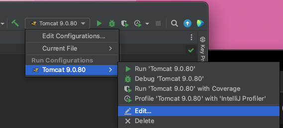

```bash
OS
# 2020 Intel - macOS Monterey
# shell - bash

Version
# openJDK@17
# tomcat@9
```


## install openJDK

```bash
  brew install openjdk@17
```


### JAVA_HOME 환경변수 설정

```bash
  vim ~/.bash_profile
```

```bash
export LANG="en_US.UTF-8"

JAVA_8_HOME=/Library/Java/JavaVirtualMachines/adoptopenjdk-8.jdk/Contents/Home
JAVA_15_HOME=/Library/Java/JavaVirtualMachines/adoptopenjdk-15.jdk/Contents/Home
JAVA_17_HOME=/usr/local/opt/openjdk@17/libexec/openjdk.jdk/Contents/Home


alias JAVA8='export JAVA_HOME=$JAVA_8_HOME'
alias JAVA15='export JAVA_HOME=$JAVA_15_HOME'
alias JAVA17='export JAVA_HOME=$JAVA_17_HOME'

#default to Java15
JAVA17
```

```bash
source ~/.bash_profile
```

### 환경변수 확인

```bash
jjangchanui-MacBookPro:Home jjangchan$ java --version
openjdk 17.0.8.1 2023-08-24
OpenJDK Runtime Environment Homebrew (build 17.0.8.1+0)
OpenJDK 64-Bit Server VM Homebrew (build 17.0.8.1+0, mixed mode, sharing)

jjangchanui-MacBookPro:Home jjangchan$ javac -version
javac 17.0.8.1
```


## install Tomcat

```bash
brew install tomcat@9
```

### 톰캣 실행 확인

```bash
jjangchanui-MacBookPro:Home jjangchan$ cd /usr/local/opt/tomcat\@9/bin/
jjangchanui-MacBookPro:bin jjangchan$ ls
catalina
jjangchanui-MacBookPro:bin jjangchan$ ./catalina start
Using CATALINA_BASE:   /usr/local/Cellar/tomcat@9/9.0.80/libexec
Using CATALINA_HOME:   /usr/local/Cellar/tomcat@9/9.0.80/libexec
Using CATALINA_TMPDIR: /usr/local/Cellar/tomcat@9/9.0.80/libexec/temp
Using JRE_HOME:        /usr/local/opt/openjdk@17/libexec/openjdk.jdk/Contents/Home
Using CLASSPATH:       /usr/local/Cellar/tomcat@9/9.0.80/libexec/bin/bootstrap.jar:/usr/local/Cellar/tomcat@9/9.0.80/libexec/bin/tomcat-juli.jar
Using CATALINA_OPTS:   
Tomcat started.
```

웹 브라우저에 http://localhost:8080/ 을 검색하면 아래와 같은 그림이 뜬다.


### 톰캣 Stop

```bash
jjangchanui-MacBookPro:bin jjangchan$ ./catalina stop
Using CATALINA_BASE:   /usr/local/Cellar/tomcat@9/9.0.80/libexec
Using CATALINA_HOME:   /usr/local/Cellar/tomcat@9/9.0.80/libexec
Using CATALINA_TMPDIR: /usr/local/Cellar/tomcat@9/9.0.80/libexec/temp
Using JRE_HOME:        /usr/local/opt/openjdk@17/libexec/openjdk.jdk/Contents/Home
Using CLASSPATH:       /usr/local/Cellar/tomcat@9/9.0.80/libexec/bin/bootstrap.jar:/usr/local/Cellar/tomcat@9/9.0.80/libexec/bin/tomcat-juli.jar
Using CATALINA_OPTS:   
NOTE: Picked up JDK_JAVA_OPTIONS:  --add-opens=java.base/java.lang=ALL-UNNAMED --add-opens=java.base/java.io=ALL-UNNAMED --add-opens=java.base/java.util=ALL-UNNAMED --add-opens=java.base/java.util.concurrent=ALL-UNNAMED --add-opens=java.rmi/sun.rmi.transport=ALL-UNNAMED
```

### IntelliJ 톰캣 설정

- Preferences 클릭
- Build, Execution, Deployment 클릭
- Application Servers 클릭
- Tomcat Home : /usr/local/Cellar/tomcat@9/9.0.80/libxec 설정


## IntelliJ + Tomcat + JSP 프로젝트 생성 방법


- Template : Web application 
- JDK: 17 java version "17.0.8"


- Vesion : Java EE 8
- Added dependencise : Servlet


### 톰캣 포트 변경 

아래와 같이 톰캣 > 화살표 클릭하고 Edit 클릭



- [HTTP port] 에 원하는 톰캣 포트 설정


