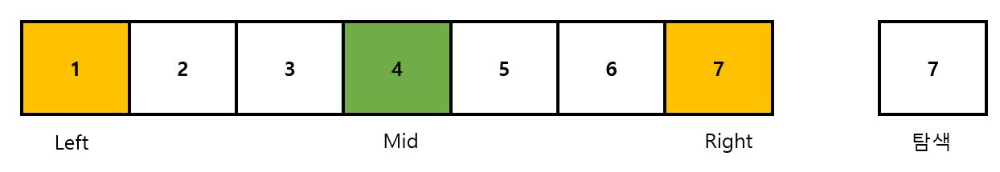
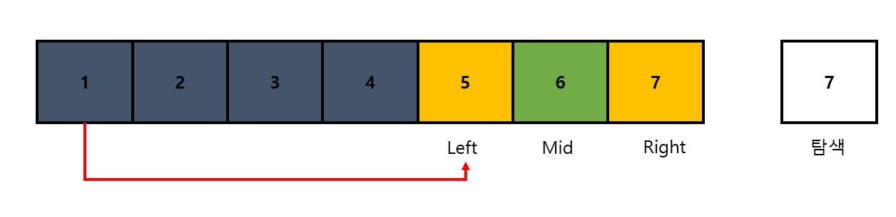
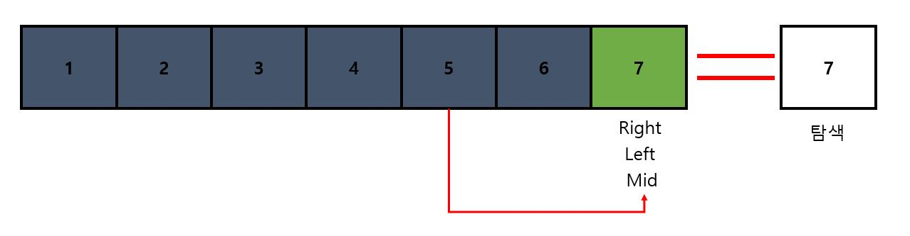

# 이진 탐색 알고리즘(Binary Search Algorithm)


__탐색 범위를 반 씩 줄어가면 탐색 하는 기법, 제약 조건은 데이터가 정렬 되어 있어야 한다.__


## 원리

1.  처음 index를 지정해준다. 

   __Left = 첫 번쨰 index__  

   __Right = 마지막 index__

   __Mid = {Left(index) + Right(index)} / 2__ 




2. 탐색하는 Value(6) 가,

   

   __1) Mid 값과 같으면 탐색 종료__

   __2) Mid 값 보다 크면 Left << Value << Mid 범위 안에 없으므로 Left 위치를 Mid+1 로 이동__

   __3) Mid 값 보다 작으면 Mid << Value << Right 범위 안에 없으므로 Right 위치를 Mid-1 로 이동__

   

   따라서, Mid(4) < Value(7) 이므로 Left(Mid+1) 로 이동 하고 Mid 값을 재산출 한다.




​	3. Mid(6) < Value(7) 이므로 Left(Mid+1) 로 이동 하고  Mid 값을 재산출하고 Mid값이 Value 값이랑 같으므로 탐색 완료



## Code

```c++
#include <iostream>
#include <vector>
#include <algorithm>


template <typename T>
int BinarySearch(const std::vector<T> v,const int left, const int right, const T value)
{
    if(right < left)
        return -1;
    int mid = (left+right)/2;
    if(v[mid] == value)
        return mid;
    else if(v[mid] > value)
        return BinarySearch(v, left, mid-1, value);
    else
        return BinarySearch(v, mid+1, right, value);
}

int main() {
    std::vector<int> v  = {3, 2, 1, 5 ,6 , 15, 200, 300, 150, 99, 26};
    std::sort(v.begin(), v.end());
    int left = 0;
    int right = v.size()-1;
    std::cout << BinarySearch(v, left, right, 150);
    return 0;
}
```


## 최악의 경우(Worst case) 시간복잡도


1. n이 1이 되기까지 2로 나누고 나머지를 버린다. 비교연산 횟수 총 K회
2. n이 1이 되었을 때, 마지막 비교연산 1회


$$
T(n) = k + 1 
\\
k = n \times (\frac{1}{2})^k=1 
\\
n = 2^k 
\\
k = log_2n 
\\
\therefore T(n) = log_2n+1
$$
