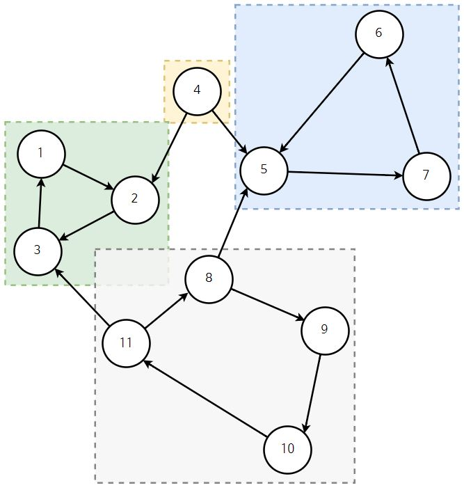
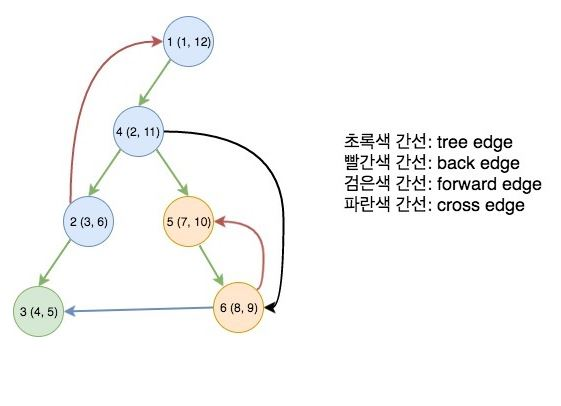
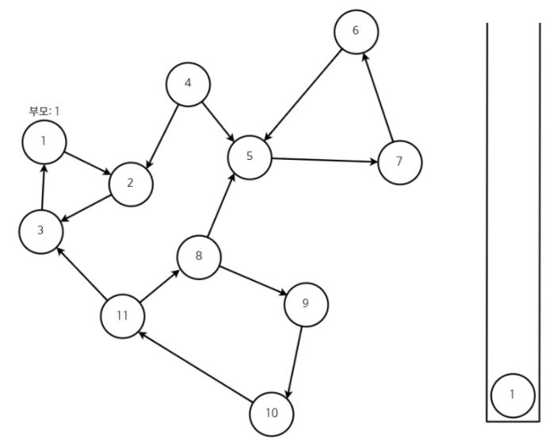
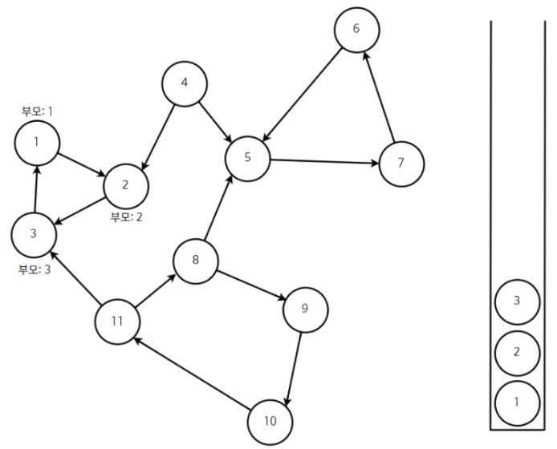
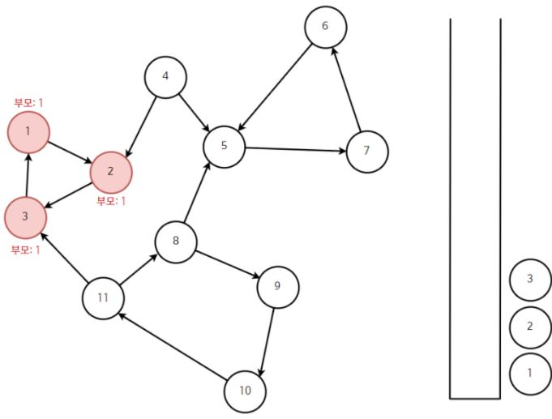
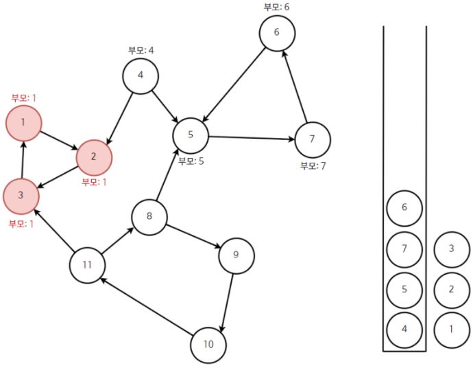
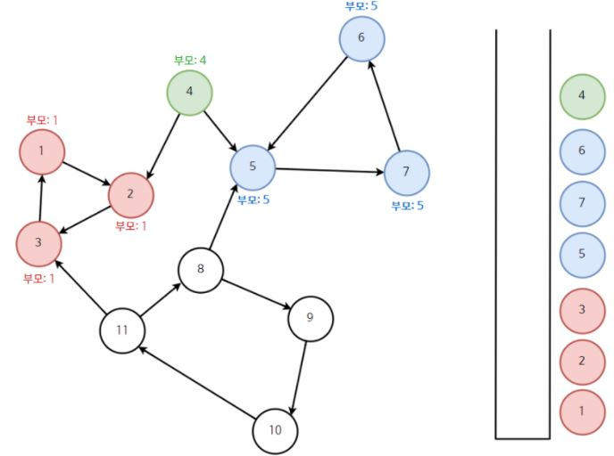
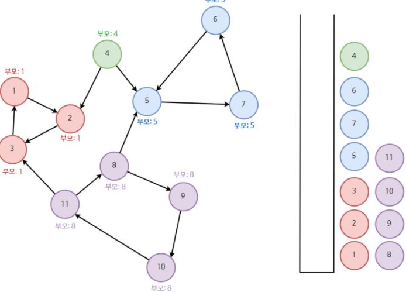

# 강한 결합 요소(Strongly Connected Component)

노드 정점이 **사이클이 발생하는 경우** 무조건 SCC에 해당한다.

SCC를 추출하는 대표적인 알고리즘은 **코사리주 알고리즘(Kosaraju's Algorithm)과 타잔 알고리즘(Tarjan's Algorithm) 이 있다.**

## DFS 간선의 분류

괄호안의 숫자는 (discovery time, finish time)

1. tree edge 

   그래프의 간선들 중 DFS트리에 속하는 간선, **dt[u] < dt[v] 이고, ft[u] > ft[v]**

2. back edge

   그래프의 간선(u -> v)들 중에서, DFS트리에서 v가 u의 조상인 간선이다. 즉 거꾸로 조상한테 올라간 간선, **dt[u] > dt[v] 이고, ft[u] < ft[v]**

3. foward edge

   그래프의 간선(u -> v)들 중에서, DFS트리에서 u가 v의 조상인데 tree edge에는 속하지 않는 간선, **dt[u] < dt[v] 이고, ft[u] > ft[v]**

4. cross edge

   위의 3가지 간선에 해당하지 않는 간선, 간선(u -> v) 들 중에서, DFS트리에서 u가 v의 조상도 아니고, v가 u의 조상도 아닌 경우 **dt[u] > ft[v]**

   

## 코사리주 알고리즘(Kosaraju's Algorithm)

SCC를 분리하는 알고리즘

### 작동 원리

### 정당성 증명

다음 두 가지를 증명하면 이 알고리즘이 정당하다는 것을 보일 수 있습니다.1. 역방향 그래프에서 DFS를 돌릴 때, 어떠한 정점 v에서 출발하는 DFS는 v와 같은 SCC에 포함되는 모든 정점을 방문한다.2. 역방향 그래프에서 아직 방문하지 않은 정점들 중, finish time이 가장 큰  v에서 출발하는 DFS는 v와 같은 SCC에 포함되지 않는 점들은 방문하지 않는다.
1번은 자명합니다. 임의의 두 정점 u, v가 그래프G에서 같은 SCC에 속한다면, 그래프 G에서 u → v 경로가 반드시 존재합니다. 그러면 역방향 그래프 T에서 v → u 경로는 반드시 존재하게 됩니다.  따라서 역방향 그래프의 임의의 정점 v에서 출발하는 DFS는 v와 같은 SCC에 속하는 모든 정점을 방문하게 됩니다.

2번을 증명하자면

어떠한 두개의 강결합 컴포넌트 scc1, scc2가 있을 때, 각각의 scc에서  finish time이 가장 큰 점을 각각 v1, v2라 하고, 그 finish time을 f1, f2 (f1 > f2)라고 하자. 그래프 G에서 scc2의 임의의 정점 u에서 scc1의 임의의 정점 v로 오는 간선은 존재할 수 없습니다. 또한 그래프 G에서 scc2 → scc1 간선이 없다면, 역방향 그래프 T에서 scc1 → scc2 간선도 없습니다. 따라서 역방향 그래프에서 v1에서 출발하는 DFS는 scc2에 해당하는 정점들을 방문하지 않습니다. 그렇다면 그래프 G에서 scc2 → scc1 간선이 없다는 것을 증명해봅시다.

scc2에서 scc1으로 오는 간선 b → a 가 있다면

1. 그 간선이 tree edge일 수 있을까요?

   그 간선이 tree edge라면 f1 < f2가 될 수밖에 없기 때문에 가정에 모순입니다.

2. 그 간선이 forward edge일 수 있을까요?

   그 간선이 forward edge라면 f1 < f2가 될 수밖에 없기 때문에 가정에 모순입니다.

3. 그 간선이 cross edge일 수 있을까요?

   그 간선이 cross edge라면 f1 < f2가 될 수밖에 없기 때문에 가정에 모순입니다.

4. 그 간선이 back edge일 수 있을까요?

   간선 b → a가 back edge라면, DFS트리에서 a가 b의 조상이고 당연하게도 a → b 경로도 존재한다는 말이 되는데, 그러면 a → b경로도 존재하고 b → a 경로도 존재하게 되므로, 두 정점이 서로 다른 scc에 속한다는 가정에 모순입니다.

방향성 그래프에서 DFS를 할 때, 모든 간선은 저 4가지중 하나에 속하게 되는데, scc2에서 scc1으로 오는 간선 b → a는 4가지중 어느것도 될 수 없으므로 존재할 수 없습니다. 

이로서 Kosaraju's algorithm의 정당성이 증명되었습니다.

## 타잔 알고리즘(Tarjan's Algorithm)

모든 정점에 대해 DFS를 수행하여 SCC를 찾는 알고리즘

정점 1부터 DFS로 탐색을 실시한다. 방문한 정점은 스택에 쌓는다.

간선에 순서에 따라 정점(1 -> 2 -> 3)을 방문하고 다시 정점 1을 방문하게 된다.

마지막으로 방문한 정점은 1은 **자기 자신이기 떄문에 SCC에 부모에 해당하므로** 부모 값을 다 1로 변경하고 스택에 쌓인 정점은 하나의 **SCC 그룹** 이 된다.

다음 DFS는 정점4에서 시작으로 탐색( 4-> 5-> 7 -> 6 -> 5)한다.

마지막 방문한 정정5는 자기 자신이므로 정점 5까지 쌓인 정점을 `pop` 하고 SCC그룹을 만든다.

스택에 남은 정점4 또한 자기 자신으로 `return` 되므로 스택에서 빼서 SCC그룹을 만들어 총 3개의 SCC 그룹이 만들어진다.

이렇게 나머지 정점또한 DFS탐색을 실시하면 총 4개의 SCC그룹이 만들어진다.

시간 복잡도는 O(V+E) 가 된다.

> 출처
>
> https://seungkwan.tistory.com/7?category=696815
>
> https://m.blog.naver.com/PostView.naver?isHttpsRedirect=true&blogId=ndb796&logNo=221236952158

