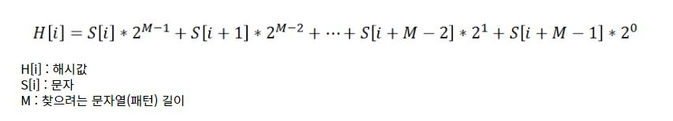

# 라빈-카프(Rabin-Karp) 알고리즘

해시를 활용한 문자열 검색,

수식으로 구한 해쉬값을 한칸식 이동하면서 구하고 본문 해시 값과 패턴 해시 값이 같은지 여부를 확인

해시 충돌시 이는 무시해도 되며 본문 해시와 패턴 해시 값이 같다면 실제 본문 값과 실제 패턴 값을 비교 확인


## 수식 




한칸씩 이동할때마다 이동 전 맨 앞의 해시값을 빼주고 `2` 를 곱하고 이동 후 맨 뒤의  해시값을 더해주면 된다.

`이동 후  = 2*(본문해시 - 이동 전 맨 앞 해시) + 이동 후 맨 뒤 해시값`


## 시간복잡도 , code

**시간복잡도 = O(n)**

```cpp
#include <iostream>
#include <string>
#include <cmath>

 int rabin_karp(const std::string& str, const std::string& pattern){
    int pattern_length = pattern.length();
    int str_hash = 0, pattern_hash = 0;
    for(int i = 0; i < pattern_length; i++){
        str_hash += (str[i]* (int)pow(2, pattern_length-1-i));
        pattern_hash += (pattern[i]* (int)pow(2, pattern_length-1-i));
    }
    // start , 시간복잡도 = O(n)
    for(int i = 0; i <= str.length()-pattern_length; i++){
        if(str_hash == pattern_hash){
            // verify
            bool is = true;
            for(int j = 0; j < pattern_length; j++){
                if(pattern[j] != str[i+j]){
                    is = false;
                    break;
                }
            }
            if(is) return i;
        }else if(i != str.length()-pattern_length){
            int first = str[i]* pow(2, pattern_length-1);
            str_hash = 2*(str_hash-first)+str[i+pattern_length];
        }
    }
    return -1;
}

int main() {
    std::string str = "avsdasds2ddsavvbsda";
    std::string patter = "2dd";
    std::cout << rabin_karp(str, patter);
    return 0;
}
```


​																			

# KMP

두개의 문자열 T(text) 와 P(pattern) 가 있다. P가 T에 대해서 __몇 번 매칭 되는지, 또한 어느 위치에서 시작하는지에__ 대한 '문자열 매칭' 알고리즘을 알아보자.


## 단순한 O(nm) 시간 복잡도 알고리즘

가장 단순한 방법으로,  for문을 두번 돌리는 방법이다.  

T의 길이가 `n`  , P의 길이가 `m` 일 때 `m <= n` 이면,  n을 돌면서 m 만큼 하나씩 검사하면 된다. 따라서 시간복잡도는 O(nm) 이 나온다.


```
T = 'ABCDABCD'
P = 'ABCD'

..Loop..
1) ABCDABCD
   ABCD

2) ABCDABCD
    ABCD
    
3) ABCDABCD
     ABCD
     
.
.
.

n) ABCDABCD
       ABCD

```


## KMP를 활용한 O(n) 시간 복잡도 알고리즘

KMP는 접두사(prefix) , 접미사(suffix), Pi배열을 활용한 알고리즘이다.


### 접두사, 접미사란?

apple 이라는 단어로 예를 들어보자,


<접두사>

a

ap

app

apple


<접미사>

e

le

ple

pple

apple


### Pi 배열 이란?

'ABCABCABCA' 로 예를 들어보자,

```
A
>> none
>> Pi[0] = 0

AB
>> none
>> Pi[1] = 0

ABC
>> none
>> pi[2] = 0

ABCA
>> A(prefix) == A(suffix)
>> pi[3] = 1

ABCAB
>> AB(prefix) == AB(suffix)
>> pi[4] = 2

ABCABC
>> ABC(prefix) == ABC(suffix)
>> pi[5] = 3

ABCABCA
>> ABCA(prefix) == ABCA(suffix)
>> pi[6] = 4

ABCABCAB
>> none
>> pi[7] = 0

ABCABCABC
>> none
>> pi[8] = 0


ABCABCABCA
>> A(prefix) == A(suffix)
>> pi[9] = 1

```


### KMP

KMP는 접두사 와 접미사가 같은 부분 문자열에 길이를 pi 배열에 담고, 중간 단계를 뛰어 넘는 알고리즘이다. 

아래와 같이 T, P, pi 배열을 정의하고 예를 들어서 보자, 

T =  'ABCABCABCBCADA' 

P = 'ABCABCABCA'

Pi = {0, 0, 0, 1, 2 , 3, 4, 0 , 0, 1}


```
1)

i =  0 1 2 3 4 5 6 7 8 9
T = [A B C A B C A B C B C A D A]
     | | | | | | | | | x
P = [A B C A B C A B C A]


```


> 출처
>
> https://otrodevym.tistory.com/entry/%EC%95%8C%EA%B3%A0%EB%A6%AC%EC%A6%98%EB%AC%B8%EC%9E%90%EC%97%B4-%EA%B2%80%EC%83%89%EA%B3%A0%EC%A7%80%EC%8B%9D%ED%95%9C-%EA%B2%80%EC%83%89-%EB%9D%BC%EB%B9%88%EC%B9%B4%ED%94%84-KMP-%EB%B3%B4%EC%9D%B4%EC%96%B4%EB%AC%B4%EC%96%B4
>
> https://blog.naver.com/PostView.naver?blogId=ndb796&logNo=221240679247&redirect=Dlog&widgetTypeCall=true&directAccess=false
>
> 

