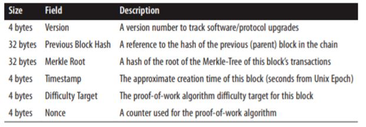

# 머클 트리(Merkle Tree)

머클트리는 데이터가 있을 때 해시된 값을 리프 노드로 만들고, 계속 __2개씩 해시하면 올라가__ 루트까지 가는 이진트리이다.

장점은 <u>위변조 검사가 쉽다</u>. 왜냐하면 2개씩 짝지어 해시하기 떄문에 하나라도 값이 바뀌면 머클루트값이 변하기 때문이다.

위 그림은 블록헤더의 구조이다. 머클루트는 위에 보시는 것과 같이 블록헤더에 저장된다.

