# 1. 기수 트리(Radix trie)

**Data**

**{**

 **do: 0,**

 **dog: 1,**

 **dax: 2,**

 **dogu: 3,**

 **dodo: 4,**

 **house: 5,**

 **houses: 6**

**}**

위의 데이터로 기본적인 기수트리를 표현하면 아래 그림과 같다.

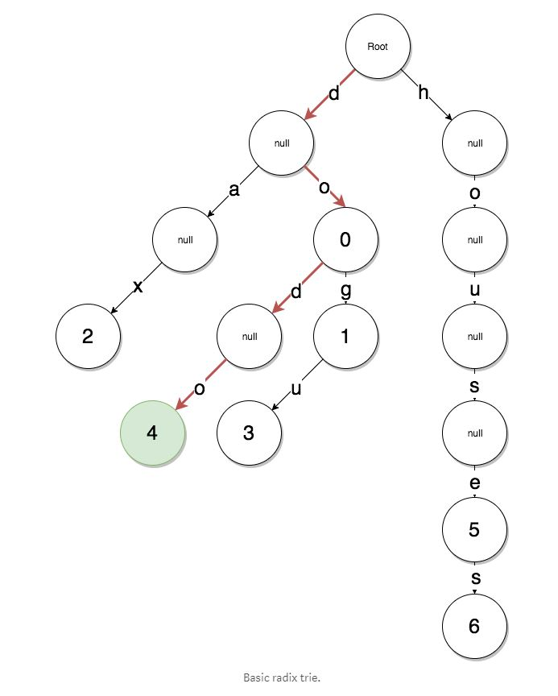

기본적인 기수트리의 문제점은 houses 키를 통해서 value값 6을 표현하기 위해서 null 노드를 너무 많이 타면서 공간을 낭비하게 된다.

이러한 공간낭비를 줄이기 위해 다음과 같은 형태로 기수트리가 표현 된다.

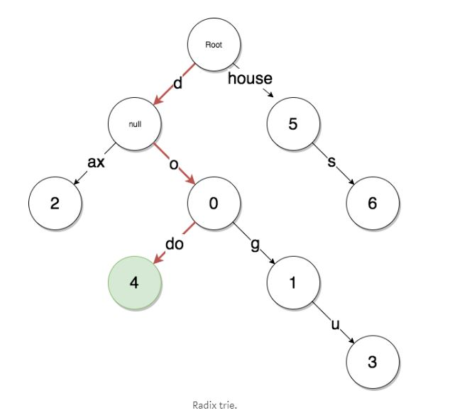

이와같이 중간에 분기가 없는 키(null)를 하나의 키로 합쳐서 사용하는것이 최적화 패트리샤 트리의 기본이라고 할 수 있다.

# 2. 머클 트리(Merkle Tree)

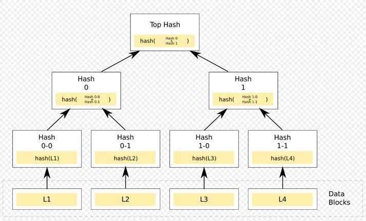

머클트리는 데이터가 있을 때 해시된 값을 리프 노드로 만들고, 계속 __2개씩 해시하면 올라가__ 루트까지 가는 이진트리이다.

장점은 <u>위변조 검사가 쉽다</u>. 왜냐하면 2개씩 짝지어 해시하기 떄문에 하나라도 값이 바뀌면 머클루트값이 변하기 때문이다.

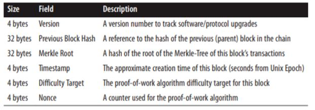

위 그림은 블록헤더의 구조이다. 머클루트는 위에 보시는 것과 같이 블록헤더에 저장된다.

# 3. 패트리샤 트리(Patricia tree)

트라이 트리라고 보면 된다.

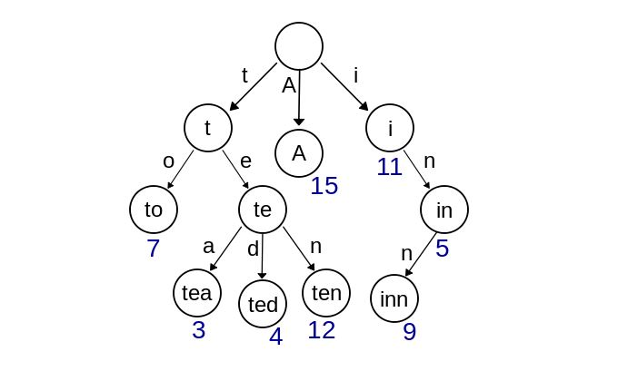

그림과 같이 노드마다 한글자씩 담당해 단어를 만들어가는 형태의 트리이다.

장점은 중복되는 것을 효율적으로 줄일 수 있고, 시간복잡도는 O(m) 이 된다.  `m` 은 문자열 길이이다.

# 4. 머클-패트리샤 트리(Merkle-Patricia tree)

다음과 같은 Key, Value를 가지고 있는 데이터로 패트리샤 트리를 구성합니다.

**Data {**

 **'cab8': 'dog',**

 **'cabe': 'cat',**

 **'39': 'chicken',**

 **'395': 'duck',**

 **'56f0': 'horse'**

**}**

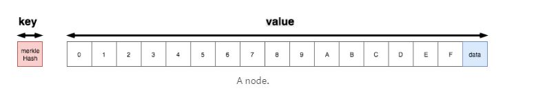

이더리움에서 노드는 위와같이 key-value의 형태로 저장된다. 특징은 아래와 같다.

1. __key는 value의 hash 값__으로 이루어져 있다.
2. value는 17개의 요소로 구성되며 16개의 요소는 hex 값을 나타내고 마지막 17번째 요소에 노드가 가지고 있는 __데이터__가 저장되어 있다.
3. __key__값에 해당하는 hash값은 __"database lookup"__ 에 사용되는데, 이는 레벨DB로 저장되어 있는 데이터베이스에서 특정 노드를 검색하는데 사용된다.
4. __value__는 __"tree lookup"__에 사용되며, 이는 기수트리에서 패스를 통해 데이타를 찾는데 사용된다.

위에서 정의한 데이타셋의 사용하여 먼저 비효율적인 패트리샤 트리를 구성해보도록 합니다.

위에 데이터셋을 이용하여 cabe 키에 해당하는 값을 찾는 과정을 살펴보자.

이 과정에서는 레벨DB에서 해당노드를 검색하는 과정(__TDL : Database Lookup__)과 기수트리에서 검색하는 과정(__TTL : Trie Lookup__)으로 나누어진다.

1. 키값 `cabe`는 패스를 `c, a, b, e` 로 분리를 하여 순차적으로 패스에 사용된다.
2. rootHash에서 패스에 해당되는 연관된 rootNode를 레벨DB에서 검색한다. (TDL)
3. rootHash에서 첫번쟤 경로인 `c`에 해당하는 값 `hashB`를 검색한다. (TTL)
4. DB에서 `hashB`를 검색한후에(TDL), `hashB`의 a번째 인자를 검색하여 `hashI`임을 확인한다. (TTL)
5. DB에서 `hashl`를 검색한후에(TDL), `hashI`의 `b`번째 인자를 검색하여 `hashJ`임을 확인한다. (TTL)
6. DB에서 `hashJ`를 검색한후에(TDL), `hashJ`의 `e`번째 인자를 검색하여 `hashL`임을 확인한다. (TTL)
7. 이 단계에서 검색경로(cabe)가 종료된다. 이때 `hashL`의 값이 최종 값이며, 이는 `cat`임을 알수 있다.

이 과정에 value를 찾기위한 경로는 기수트리(Radix trie)가 사용되고, 트리의 각 노드에서 특정 노드의 value가 변경되면 머클트리의 특성에 따라 rootHash가 변경된다. 하지만 위에 과정은 null 값을 가져 공간을 많이 차지하면서 메모리 낭비를 발생시키고 있다.

메모리 낭비를 개선하기 위해 다음과 같이 변경을 합니다.

먼저 각각의 노드를 __리프(ref)  노드__와  __확장(extension) 노드__로 구분한다.

데이타의 끝까지 분기되는 경로가 없는 `56f0` 경로의 경우, 많은 null 노드로 인해 데이타 낭비가 발생하게 되는데, 이와같은 경우에 리프노드를 정의하여 메모리 낭비를 개선할수 있습니다. `56f0`의 경우에는 데이타의 끝까지 분기되는 경로가 없기때문에 최초 rootHash에서 `5`에 해당하는 `hashE`를 검색하여 `hashE`를 찾은후 `hashE`에 나머지경로 `6f0`을 할당하고, 리프노드로 정의하고 데이타를 할당하여 메모리를 절약할수 있습니다. 즉 기존에 16개의 값을 저장하는 공간을 하나의 값만 저장하는 공간으로 변경하여 메모리를 줄이게 되는 것입니다. 이는 처음에 기수트리에서 메모리 낭비를 없애기 위해 분기가 발생하지않는 이어진 경로를 하나로 합쳐서 메모리를 절약하는 방법에 해당합니다.

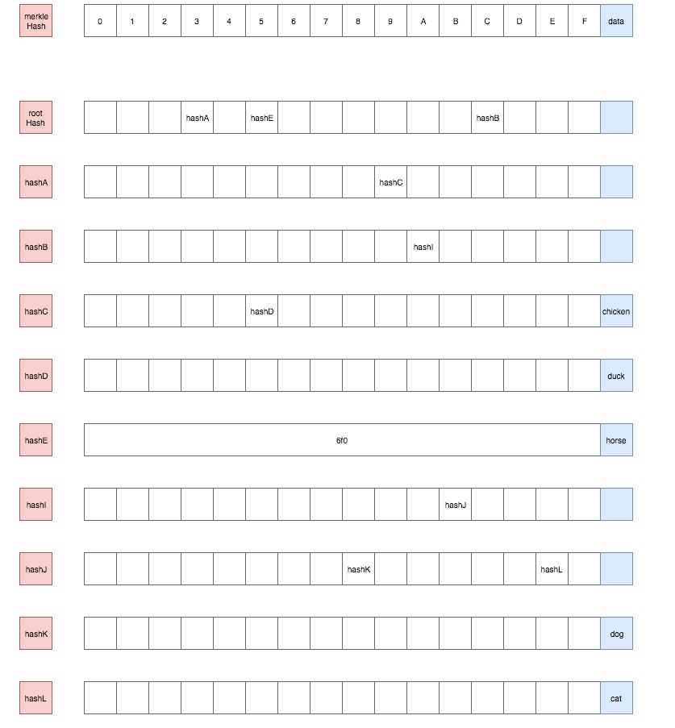

중간에 분기 경로가 있는`cab -> 8, e` 는 확장노드로 정의하여 메모리를 절약할수 있다.

첫번째 `c`에서 `hashB` 를 찾고, `hashB`는 **확장노드**로 정의하고, value의 경로는 `ab`로 정의하고, 데이터는 `hashJ` 로 정의한다.

`hashJ`에서는 경로 `8`과`e`를 통해 `hashK`와`hashL`를 알게되고, 각각의 리프노드인 `hashK`와 `hashL` 의 값인 **"dog"**, **"cat"**을 찾을수 있다.

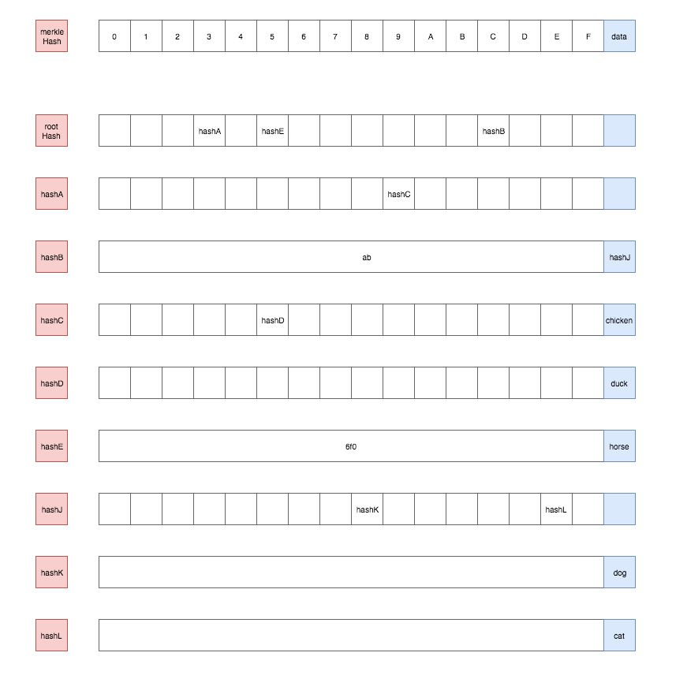

이와같이 나머지 리프노드를 모두 재정의하여 다음과 같이 최적화된 메모리 구조를 구성할수 있다.

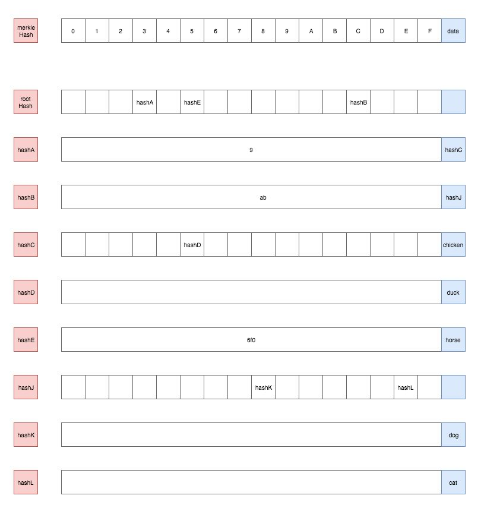

마지막으로 머클-패르리샤 트리에서는 리프노드와 확장노드에 prefix를 붙이는 HP(Hex-Prefix encoding)  엔코딩을 하여 각각 리프노드와 확장노드를 구분할수 있도록한다. 

prefix는 다음과 같이 4가지 형태로 정의된다.

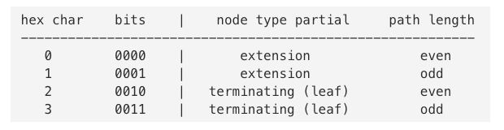

또한 nibble의 갯수는 짝수가 되야한다 왜냐하면, 바이트스트림의 최소 단위가 바이트이고, nibble은 4bit로 이루어져 있기 때문이다. 

따라서 홀수가 되어있으면 뒤에 0을 padding 해준다.

아래는 HP 엔코딩을 하여 확장노드와 리프노드에 prefix를 추가한 최종 머클-패트리샤 트리이다.

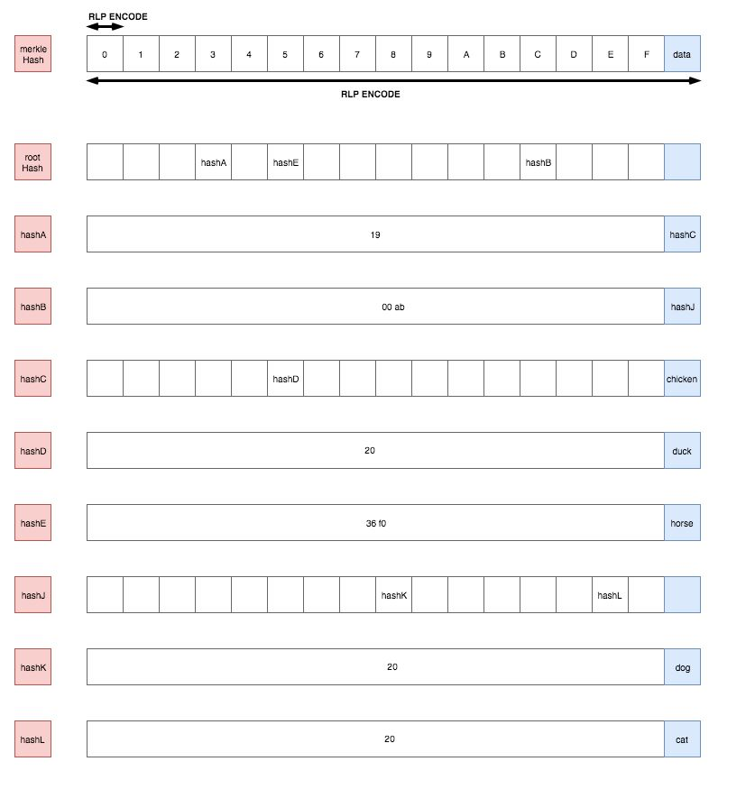

이와같은 구조를 도식화한 예는 다음과 같습니다.

하기의 예에서 "Simplified World State"의 테이블이 위 예에서의 데이타셋에 해당하는 경로와 데이타에 해당합니다.

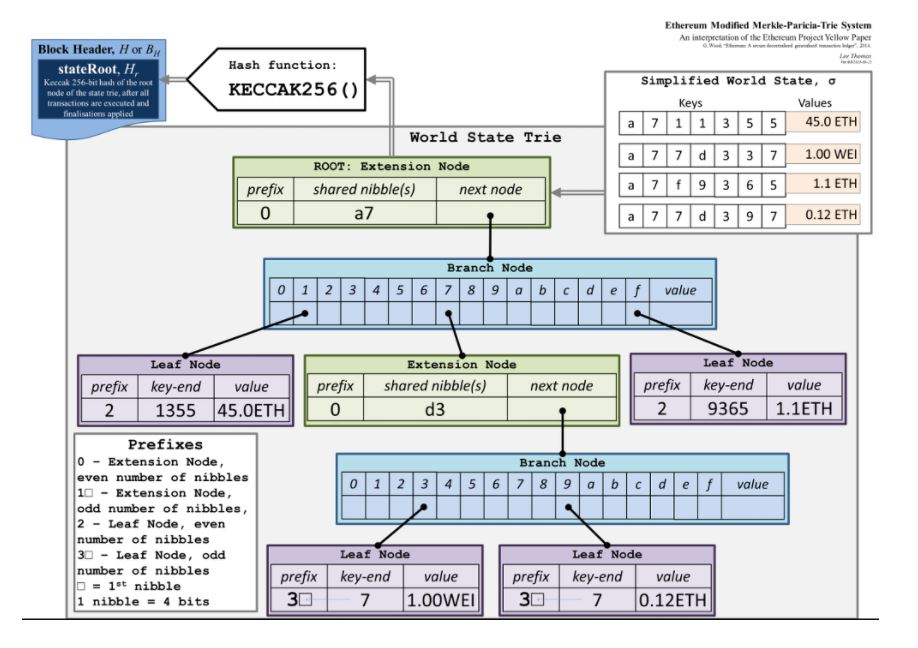

> 출처
>
> 1. https://ihpark92.tistory.com/48
>
> 2. https://sejinik.tistory.com/121
> 3. https://hingu2020.blogspot.com/2019/05/blog-post_17.html
> 4. 이더리움 블록체인 게임 개발 (키더 아이어, 크리스대넌 지음)
