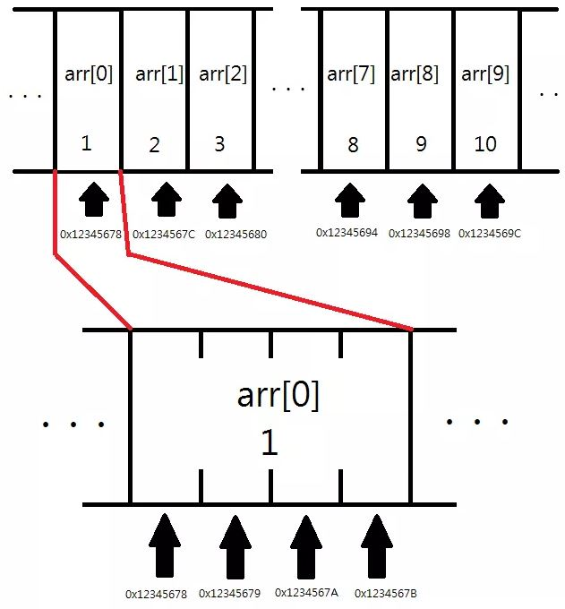
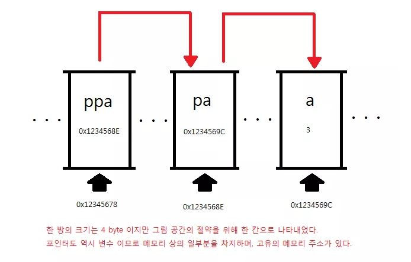

# Pointer

## 1) 포인터란

```
포인터 : 메모리 상에 위치한 특정한 데이터의 (시작)주소값을 보관하는 변수
```


## 2) & 연산자

단항 `&` 연산자는 피연산자의 주소값을 불러온다


## 3) * 연산자 

**포인터는 특정한 데이터의 주소값을 보관한다. 이 때 포인터는 주소값을 보관하는 데이터의 형에** `*` **를 붙임으로써 정의되고,** `&` **연산자로 특정한 데이터의 메모리 상의 주소값을 알아올 수 있다.**  반대로 `&` 주소에 대응되는 값을 가지고올떄 `*` 로 불러온다 


## 4) 상수 포인터

### 1. const T*

```c++
int main() {
    int a,b;
    const int* pa = &a;
    a = 5;
    pa = &b;
    // *pa = 5 // 오류
    return 0;
}
```

`pa` 를 통해서 `a` 를 간접적으로 값을 변경할 때는 `const int*` 이므로 변경이 불가능하다


### 2. T* cont

```c++
int main() {
    int a,b;
    int* const pa = &b;
    *pa = 5;
    pa = &a; // 오류
    return 0;
}
```

`const` 키워드가 `pa` 앞에 있으므로 `pa` 값 변경이 불가능함


### 3. const T* const

```c++
int main() {
    int a,b;
    const int* const pa = &b;
    *pa = 5; // 오류
    pa = &a; // 오류
    return 0;
}
```

`const` 키워드가 `int*` 앞에 `pa` 앞에 있으므로 둘다 값 변경이 불가능함


## 5) 포인터의덧셈

```c++
int main() {
    int a,b;
    int *pa, *pb;
    pa = &a;
    std::cout << pa << std::endl;
    // -> 0x62feb8
    std::cout << pa+1 << std::endl;
    // -> 0x62febc
    return 0;
}
```

 `+1` 은 **타입의 크기 만큼** 더해진다. 빼기도 똑같이 **타입의 크기 만큼** 빼진다.


## 6) 배열과 포인터

```cpp
int arr[10] = {1, 2, 3, 4, 5, 6, 7, 8, 9, 10};
```

이라는 배열은 아래와 같이 나타난다.




`int` 형 변수는 4바이트 이여서 배열이 +4씩 연속적으로 공간을 차지한다. 

```c++
int main() {
    int arr[10];
    int *ptr = &arr[0];
    std::cout << arr << " == " << &arr[0] <<std::endl;
    for(int i = 1; i < 10; i++){
        if(&arr[i] == ptr+i)
            std::cout << &arr[i] << " == " << ptr+i <<std::endl;
    }
}
```

```
0x62fe90 == 0x62fe90
0x62fe94 == 0x62fe94
0x62fe98 == 0x62fe98
0x62fe9c == 0x62fe9c
0x62fea0 == 0x62fea0
0x62fea4 == 0x62fea4
0x62fea8 == 0x62fea8
0x62feac == 0x62feac
0x62feb0 == 0x62feb0
0x62feb4 == 0x62feb4

Process finished with exit code 0
```

또한, `arr` 과 `arr[0]` 의 주소값이 동일하다. 배열의 이름은 배열의 첫 번째 원소의 주소값을 나타내고 있다. 그 이유는 배열의 이름이 `sizeof` 연산자나 `&` 연산자를 사용될 떄 경우를 빼면, **배열의 이름을 사용시 암묵적으로 첫 번째 원소를 가리키는 포인터로 타입 변환되기 때문이다.**


```c++
int main() {
    int arr[4] = {1,2,3,4};
    std::cout << arr[3] << " == " << *(arr+3) << std::endl;
    return -1;
}
```

위와 같이,  `arr+3` 으로 `a[3]` 의 주소값을 가져오고 `*` 을 앞에 붙여서 데이터의 값을 가져올수 있다.


## 7) 1차원 배열

```c++
int main() {
    int arr[10] = {100, 98, 97, 95, 89, 76, 92, 96, 100, 99};

    int* parr = arr; // int* parr = &arr[0]
    int sum = 0;

    while (parr - arr <= 9) {
        sum += (*parr);
        parr++;
    }
    printf("my average score : %d \n", sum / 10);
    return -1;
}
```

1. `parr - arr <= 9`  →  (`parr `   - `&arr[0]`) / 4(int 형)  <= 9
2. `int* parr = arr` →  `int* parr = &arr[0]` 
3. `sum += (*parr)`  → `sum = sum + *parr`
4. `parr++` → `arr` 주소를 형(4bite) 만큼 증감 


## 8) 이중 포인터

```c++
int main() {
    int a;
    int *pa;
    int **ppa;

    pa = &a;
    ppa = &pa;

    a = 3;

    std::cout << "a : " << a << " , *pa : " << *pa << " , **ppa : "  << **ppa << std::endl;
    std::cout << "&a : " << &a << " , pa : " << pa << " , *ppa : " << *ppa <<std::endl;
    std::cout << "&pa :" << &pa << <" , ppa : " << ppa << std::endl;

    return -1;
}
```

```
OutPut
a : 3 , *pa : 3 , **ppa : 3
&a : 0x62feb8 , pa : 0x62feb8 , *ppa : 0x62feb8
&pa :0x62feb4 , ppa : 0x62feb4
```


```c++
ppa = &pa;
```

`ppa` 에는 `pa` 의 주소값이 들어가있으므로 따라서,

```c++
std::cout << "&pa :" << &pa << " , " << " , ppa : " << ppa << std::endl;
```

**0x62feb4** 값이 출력된다.

```c++
std::cout << "&a : " << &a << " , pa : " << pa << " , *ppa : " << *ppa <<std::endl;
```

`*ppa` 는 `pa` 의 데이터 값을 출력한다. `pa` 에는 `a` 의 주소값이 담겨져있으므로 따라서 `&a` 의 주소값 **0x62feb8**을 출력한다.

```c++
 std::cout << "a : " << a << " , *pa : " << *pa << " , **ppa : "  << **ppa << std::endl;
```

`**ppa` 는 `*(*ppa)` 이다. `*ppa` 는 `pa` 이므로 최종적으로 `*pa` 가 된다. `*pa`는 `a` 의 데이터값을 뜻하므로 최종적으로 `a` 의 데이터값 **3**을 출력한다.

위 관계는 아래의 그림과 같다.





## 9) 배열 이름의 주소값

```c++
int main() {
    int arr[3] = {1,2,3};
    int (*parr)[3] = &arr;

    std::cout << arr[2] << std::endl;
    std::cout << (*parr)[2] << std::endl;

    return -1;
}

```

결과는,

```
3
3
```

이다. 그러면 `&arr` 이란 무엇일까?

```C++
int (*parr)[3] = &arr;
```

`arr` 은 **크기가 3인 배열** 이기 때문에, `&arr` 을 보관할 포인터는 **크기가 3인 배열을 가리키는 포인터** 이다. 

`parr` 은 *크기가 3 인 배열을 가리키는 포인터*  이기 떄문에 배열을 직접 나타내기 위해서는 `*` 연산자를 통해 원래의 `arr` 을 참조해야 한다. 따라서 `(*parr)[2]` 과 `arr[2]`  은 같은 문장이 된다.


또한 `parr` 과 `arr` 은 같은 값을 가진다.

```c++
int main() {
    int arr[3] = {1,2,3};
    int (*parr)[3] = &arr;

    std::cout << "arr : " << arr << std::endl;
    std::cout <<"parr : " << parr << std::endl;

    return -1;
}
```

```
arr : 0x62feb0
parr : 0x62feb0

Process finished with exit code -1
```

`arr` 과 `parr` 모두 배열의 첫 번째 원소의 주소값을 출력한다. 왜냐하면, `arr` 자체가 어떤 메모리 공간에 존재하는 것이 아니기 때문이다.


> 이와 같이 C 언어가 변태적으로 동작하는 이유는 사실 그 역사에 숨어있습니다. C 언어는 B 언어에서 파생된 언어인데, B 언어에서는 실제 배열이 있고, 배열을 가리키는 포인터가 따로 있었습니다. B 언어에서 `arr` 과 `arr[0]`, `arr[1]` 은 각기 다른 메모리를 차지하는 녀석들이고, `arr` 이 실제로 `arr[0]` 를 가리키는 포인터 였습니다. 따라서 `arr` 의 값을 출력하면 실제로 `arr[0]` 의 주소값이 나왔고, `&arr` 은 `arr` 의 주소값이 나왔겠지요. 따라서 B 언어에서 `arr` 과 `&arr` 은 다른 값을 출력했을 것입니다.
>
> 하지만 C 언어를 만든 데니스 리치 아저씨는 B 언의 문법을 계승하되, 이와 같이 비효율적으로 배열을 정의할 때 배열의 시작점을 가리키는 포인터로 공간을 낭비하고 싶지 않았습니다. 따라서 위와 같이 조금 이상하지만 그래도 메모리 공간을 효율적으로 쓰게 되는 배열 - 포인터 관계가 탄생하게된 것입니다.


## 2차원 배열의 [] 연산자

```c++
int arr[2][3]
```

메모리는 `int arr[3]` 짜리 배열 2개가 연속으로 존재한다고 생각하면된다.


```c++
int main() {
    int arr[3][3] = {{4,5,6},{1,2,3}};

    std::cout << "arr[0] : " << &arr[0] << std::endl;
    std::cout << "&arr[0][0] : " << &arr[0][0] << std::endl;
    std::cout << "arr[1] : " << &arr[1] << std::endl;
    std::cout << "&arr[1][0] : " << &arr[1][0] << std::endl;

    return -1;
}
```

```
[OutPut]
arr[0] : 0x62fe9c
&arr[0][0] : 0x62fe9c
arr[1] : 0x62fea8
&arr[1][0] : 0x62fea8
```

`arr[0]` == `&arr[0][0]`  같고, `arr[1]` == `arr[1][0]` 과 같다. 1차원 배열이랑 마찬가지로 `sizeof` 나 주소값 연산자와 사용되지 않을 경우,**`arr[0]` 은 `arr[0][0]` 을 가리키는 포인터로 암묵적으로 타입 변환되고, `arr[1]` 은 `arr[1][0]` 을 가리키는 포인터로 타입 변환된다**라는 뜻이 된다.


> 출처
>
> https://modoocode.com/135


