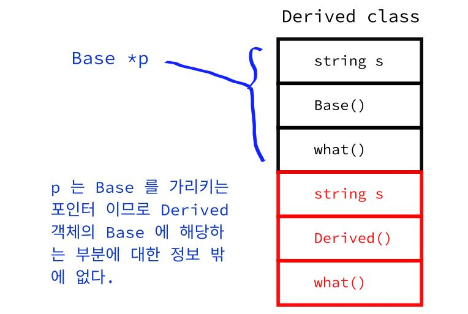
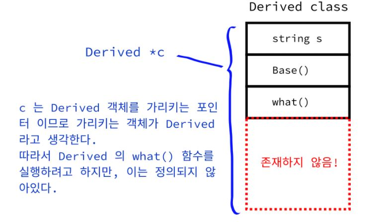
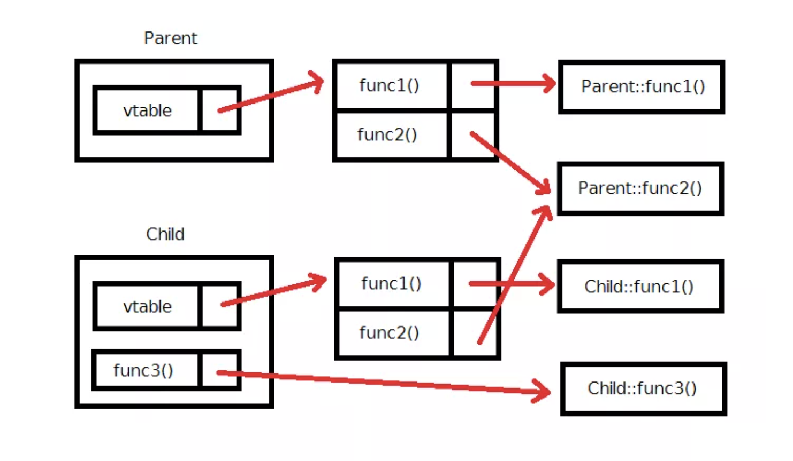
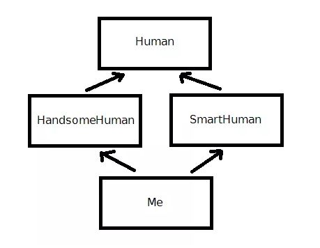

# 상속(Inheritance)

c++ 에서 상속을 통해 다른 클래스의 정보를 물려 받아서 사용할 수 있다.


## 1. 상속 선언

기반 클래스를 선언하고,

```c++
class Base{
private:
    std::string s;
public:
    Base() : s("base"){ std::cout << "base class" << std::endl;}
    void println() const {std::cout << s << std::endl;}

};

```

아래와 같이 파생클래스를 상속 받으면 된다.

```c++
class Derived : public Base{
private:
    std::string s;
public:
    Derived() : Base(), s("derived") {
        std::cout << "derive" << std::endl;
        println();
    }
};
```

여기서 `Derived` 가 `Base` 를 `public` 형식으로 상속 받는 뜻이다. 따라서 `Derived` 는 `Base` 클래스의 `println` 함수를 호출할수 있게 된다.


생성자 초기화 리스트에서 기반의 생성자를 호출해서 기반의 생성을 먼저 처리하고, `Dervied` 의 생성자가 실행 되어야 한다.

```c++
erived() : Base(), s("derived")
```

만약 기반 클래스의 생성자를 명시적으로 호출하지 않으면 기반 클래스의 **디폴트 생성자가 호출된다.**


## 2. 오버라이딩(Overriding)

만약 기반 클래스에도 `println` 함수를 선언하면 어떻게 될까?

```c++
class Base{
private:
    std::string s1;
public:
    Base() : s1("base"){ std::cout << "base class" << std::endl;}
    void println() const {std::cout << s1 << std::endl;}

};

class Derived : public Base{
private:
    std::string s;
public:
    Derived() : Base(), s("derived") {
        std::cout << "derived class" << std::endl;
        println();
    }

    void println() const {std::cout << s << std::endl;}
};

int main() {
    Base p;
    Derived d;
    return 1;
}
```

```
base class
base class
derived class
derived
```

위 경우에는 `Derived` 에  `println` 함수가 선언되어 있기 때문에 굳이 멀리 있는 `Base` 의 함수 까지 뒤지지 않고, 바로 앞에 있는 `Derived` 의  `println` 함수를 호출하게된다. 

`Derived` 의 `println` 함수가  `base` 의  `println` 함수를 **오버라이딩(overriding)** 한것이다.


## 3. Protected 

```c++
class Base{
private:
    std::string s1;
public:
    Base() : s1("base"){ std::cout << "base class" << std::endl;}
    void println() const {std::cout << s1 << std::endl;}

};

class Derived : public Base{
private:
    std::string s;
public:
    Derived() : Base(), s("derived") {
        std::cout << "derived" << std::endl;
        println();
        s1 = "aaa"; // error : string Base::s1' is private within this context
    }

    void println() const {std::cout << s << std::endl;}
};
```

기반 클래스의 `s1` 은 수정할 수 없다. 왜냐하면 `private` 키워드 때문에 자기 자신 말고는 접근할 수 없다. 따라서 `protected` 라는 키워드를 사용한다. 이 키워드는 **속받는 클래스에서는 접근 가능하고 그 외의 기타 정보는 접근 불가능** 이라고 보시면 된다.


## 4. 상속 접근 지시자 키워드

처음 상속할 때 접근 지시자 키워드를 사용한다.

```c++
class Derived : public Base
```

여기서 키워드가  `public` , `protected`, `private` 에 따라 상속 받는 클래스에서 기반 클래스의 멤버들이 실제로 어떻게 작동하는지 영향을 준다.

- 만일 위처럼 `public` 형태로 상속 하였다면 기반 클래스의 접근 지시자들에 영향 없이 그대로 작동합니다. 즉 파생 클래스 입장에서 `public` 은 그대로 `public` 이고, `protected` 는 그대로 `protected` 이고, `private` 은 그대로 `private` 입니다.
- 만일 `protected` 로 상속하였다면 파생 클래스 입장에서 `public` 은 `protected` 로 바뀌고 나머지는 그대로 유지됩니다.
- 만일 `private` 으로 상속하였다면 파생 클래스 입장에서 모든 접근 지시자들이 `private` 가 됩니다.

아래 예제를 통해 알아보자,

```c++
class Base{
public:
    std::string s1;
public:
    Base() : s1("base"){ std::cout << "base class" << std::endl;}
    void println() const {std::cout << s1 << std::endl;}

};

class Derived : private Base{
private:
    std::string s;
public:
    Derived() : Base(), s("derived") {
        std::cout << "derived" << std::endl;
    }

    void println() const {std::cout << s << std::endl;}
};

int main() {
    Base p;
    // 기반 클래스를 통해서는 public 이므로 접근 가능
    p.s1;
    Derived d;
    // 파생 클래스 에서는 (private 로 상속 받았기 때문에) private가 되어서 접근 불가능
    d.s1;
    
    return 1;
}
```


## 5. is 'a' & has 'a'

클래스의 `is - a ` 관계에는 2가지 상속의 특징이 있다.

1. 클래스가 파생되면 파생될 수록 좀더 **특수화 (구체화;specialize**된다.
2. 기반 클래스로 거슬러 올라가면 올라갈 수록 좀 더 **일반화 (generalize)**  된다.

 `has -a` 관계 또한 갖는다. 예를들면 아래와 같이 자동차 클래스로 만들면 자동차 클래스를 구성하기 위해서는 엔진 클래스, 브레이크 클래스, 오디오 클래스 등 수 많은 클래스들이 필요하다.

```c++
class Car {
 private:
  Engine e;
  Brake b;  
  ....
};
```


## 6. 업 캐스팅 & 다운 캐스팅

```c++
class Base{
public:
    std::string s1;
public:
    Base() : s1("base"){ std::cout << "base class" << std::endl;}
    void println() const {std::cout << s1 << std::endl;}

};

class Derived : public Base{
private:
    std::string s;
public:
    Derived() : Base(), s("derived") {
        std::cout << "derived class" << std::endl;
    }
    void println() const {std::cout << s << std::endl;}
};

int main() {
    Base b;
    Derived d;

    Base* p = &d;
    p->println();
    return 1;
}

```

```
base class
base class
derived class
base
```

위 와 같이 `Base*` 에 `d` 의 주소값을 대입하면 `Base` 의 `println` 함수가 호출된다. 왜냐하면



위의 그림과 같이 `p` 는 엄연한 `Base` 객체를 가리키는 포인터 이다.

이러한 형태의 캐스팅을(즉 파생 클래스에서 기반 클래스로 캐스팅 하는 것)을 **업 캐스팅** 이라고 불른다.


만약 **다운 캐스팅**도 할 수 있을까?

```c++
class Base{
public:
    std::string s1;
public:
    Base() : s1("base"){ std::cout << "base class" << std::endl;}
    void println() const {std::cout << s1 << std::endl;}

};

class Derived : public Base{
private:
    std::string s;
public:
    Derived() : Base(), s("derived") {
        std::cout << "derived class" << std::endl;
    }
    void println() const {std::cout << s << std::endl;}
};

int main() {
    Base b;
    Derived d;

    Derived* p_d = &b;
    p_d->println(); //error : 'initializing' : cannot convert from 'Base *' to 'Derived *'

    return 1;
}
```

컴파일 오류가 난다. 




`p_d` 의 객체가 가리키는 객체는 `Base` 이므로 `Derived` 에 대한 정보가 없다. 따라서 컴파일러 상에서 함부로 다운 캐스팅 하는 것을 금지하고 있다.

```c++
class Base{
public:
    std::string s1;
public:
    Base() : s1("base"){ std::cout << "base class" << std::endl;}
    void println() const {std::cout << s1 << std::endl;}

};

class Derived : public Base{
private:
    std::string s;
public:
    Derived() : Base(), s("derived") {
        std::cout << "derived class" << std::endl;
    }
    void println() const {std::cout << s << std::endl;}
};

int main() {
    Base b;
    Derived d;

    Base* p_b = &d;
    Derived* p_d= &p_b;
    
    p_d->println();
    return 1;
}
```

근본적으로 `p_b` 가 가리키는 객체는 `Derived` 인데도 컴파일러 오류가 난다. 만약 강제적으로 타입 변환하면 어떻게 될까?

```c++
 Derived* p_d= static_cast<Derived*>(p_b);
```

비록 약간은 위험하지만 컴파일 오류를 발생시키지 않고 성공적으로 컴파일 할 수 있다.

만약 가리키는 포인터가 `Base` 이고 강제적 타입 변환( `static_cast`) 하면 아래와 같이,

```c++
nt main() {
    Base b;
    Derived d;

    Base* p_b = &d;

    Derived* p_d = static_cast<Derived*>(b); //error : cannot cast from type 'Base' to pointer type 'Derived *'
    p_d->println();

    return 1;
}
```

컴파일 오류가 난다.


## 7. dynamic_cast

c++ 에서는 상속 관계에 있는 두 포인터들 간에 캐스팅 해주는 `dynamic_cast` 라는 것을 지원한다.

```c++
Derived* p_d = dynamic_cast<Derived*>(b); //error : cannot cast from type 'Base' to pointer type 'Derived *'
```

컴파일 할 경우 캐스팅할 수 없다고 오류가 난다.


## 8. virtual 키워드

```c++
class Base{
public:
    std::string s1;
public:
    Base() : s1("base"){ std::cout << "base class" << std::endl;}
    virtual void println() const {std::cout << s1 << std::endl;}

};

class Derived : public Base{
private:
    std::string s;
public:
    Derived() : Base(), s("derived") {
        std::cout << "derived class" << std::endl;
    }
    void println() const {std::cout << s << std::endl;}
};

int main() {
    Base b;
    Derived d;

    Base* p_b = &b;
    Base* p_d = &d;
    
    p_b->println();
    p_d->println();

    return 1;
}

```

```
base class
base class
derived class
base
derived
```

`p_b` 와  `p_d` 는 `Base` 가리키는 포인터인데 `p_d -> println()` 은 `Derived` 의 `println()` 을 호출하였다. `virtual` 키워드를 사용하기 때문에 컴파일 시에 어떤 함수가 실행될 지 정해지지 않고 런타임 시에 정해지는 일을 가리켜서 **동적 바인딩(dynamic binding)** 이라고 부른다. 그리고 `virtual` 키워드가 붙은 함수를 **가상 함수(virtual function)** 이라고 부른다. 이렇게 파생클래스의 함수가 기반 클래스의 함수를 오버라이드 하기 위해서는 두 함수의 꼴이 정확히 같아야 한다.


## 9. override 키워드

c+11에서 부터 파생 클래스에서 기반 클래스의 가상 함수를 오버라이드 하는 경우, `override` 키워드를 통해서 명시적으로 나타낼 수 있다.

```c++
class Base{
public:
    std::string s1;
public:
    Base() : s1("base"){ std::cout << "base class" << std::endl;}
    virtual void println() const {std::cout << s1 << std::endl;}

};

class Derived : public Base{
private:
    std::string s;
public:
    Derived() : Base(), s("derived") {
        std::cout << "derived class" << std::endl;
    }
    void println() const override  {std::cout << s << std::endl;}
};

int main() {
    Base b;
    Derived d;

    Base* p_b = &b;
    Base* p_d = &d;

    p_b->println();
    p_d->println();

    return 1;
}

```

`Derived` 클래스의 `println` 함수는 `Base` 클래스의 `println` 함수를 오버라이드 하므로, `override` 키워드를 통해 이를 알려주고 있다.

`override` 키워드를 사용하게 되면, 실수로 오버라이드를 하지 않는 경우를 막을 수 있다. 그리고 하나의 메소드를 호출했음에도 불구하고 여러가지 다른 작업들을 하는 것을 바로 **다형성(polymorphism)** 이라고 한다.


## 10. virtual 소멸자

상속 시에, 소멸자를 가상함수로 만들어야 된다. 만약 `virtual` 키워드를 사용하지 않으면 

```c++
int main() {
    Base *p_b = new Derived();
    delete p_b;

    return 1;
}
```

`p_b` 는  `Base` 클래스를 가리키는데 소멸자에 `virtual` 키워드가 없으므로 동적바인딩이 안되어 `Base` 소멸자만 호출 하므로 **메모리 누수(memory leak)** 가 발생한다. 따라서 기반 소멸자를 동적바인딩 해줘서 파생 클래스의 소멸자도 같이 호출해줘야 한다.


## 11. 래퍼런스도 가능

```c++
#include <iostream>

class A {
 public:
  virtual void show() { std::cout << "Parent !" << std::endl; }
};
class B : public A {
 public:
  void show() override { std::cout << "Child!" << std::endl; }
};

void test(A& a) { a.show(); }
int main() {
  A a;
  B b;
  test(a);
  test(b);

  return 0;
}
```

```
Parent !
Child!
```

`B` 클래스가 `A` 클래스를 상속 받고 있기 때문입니다. 즉, 함수에 타입이 기반 클래스여도 그 파생 클래스는 타입 변환되어 전달 할 수 있습니다.


## 12. 가상 함수의 구현 원리

실제로 자바의 경우 모든 함수들이 디폴트로 `virtual` 함수로 선언됩니다.

그렇다면 왜 C++ 에서는 `virtual` 키워드를 이용해 사용자가 직접 `virtual` 로 선언하도록 하였을까요? 그 이유는 가상 함수를 사용하게 되면 약간의 **오버헤드 (overhead)** 가 존재하기 때문이다.

```c++
class Parent {
 public:
  virtual void func1();
  virtual void func2();
};
class Child : public Parent {
 public:
  virtual void func1();
  void func3();
};
```

C++ 컴파일러는 가상 함수가 하나라도 존재하는 클래스에 대해서, **가상 함수 테이블(virtual function table; vtable)**을 만들게 된다.




가상 함수와 가상 함수가 아닌 함수와의 차이점을 살펴보자면 `Child` 의 `func3()` 같이 비 가상함수들은 그냥 단순히 특별한 단계를 걸치지 않고, `func3()` 을 호출하면 직접 실행된다. 

하지만, 가상 함수를 호출하면 실행 과정이 다르다. 가상 함수 테이블을 한 단계 더 걸쳐서, 실제로 **어떤 함수를 고를지** 결정하게 된다. 예를 들어서

```c++
Parent* p = Parent();
p->func1();
```

컴파일러는

1. `p` 가 `Parent` 를 가리키는 포인터 이므로 `func1()` 의 정의를 `Parent` 클래스에서 찾는다.
2. `func1()` 은 가상함수 이므로 `func1()` 을 직접 실행하지 않고, 가상 함수 테이블에서 `func1()` 에 해당하는 함수를 실행한다.

그리고 결과적으로 가상 함수 테이블에서 `func1()` 에 해당하는 함수(`Parent::func1()`) 을 호출하게 된다.


밑에 코드는 어떻게 실행 될까?

```c++
Parent* c = Child();
c->func1();
```

`p` 가 실제로는 `Child` 객체를 가리키고 있으므로, `Child` 객체의 가상 함수 테이블을 참조하여, `Child::func1()` 을 호출하게 된다. 따라서 성공적으로 `Parent::func1()` 를 오버라이드 할 수 있다.

이와 같이 두 단계에 걸쳐서 함수를 호출함을 통해 소프트웨어적으로 동적 바인딩을 구현할 수 있게 된다. 이러한 이유로 가상 함수를 호출하는 경우, 일반적인 함수 보다 약간 더 시간이 오래 걸리게 된다.

물론 이 차이는 극히 미미하지만, 최적화가 매우 중요한 분야에서는 이를 감안할 필요가 있습니다. 아무튼 이러한 연유로 인해, 다른 언어들과는 다르게, C++ 에서는 멤버 함수가 디폴트로 가상함수가 되도록 설정하지는 않는다.


## 13. 순수 가상 함수(pure virtual function)와 추상 클래스(abstract class)

```c++
#include <iostream>

class Animal {
 public:
  Animal() {}
  virtual ~Animal() {}
  virtual void speak() = 0;
};

class Dog : public Animal {
 public:
  Dog() : Animal() {}
  void speak() override { std::cout << "왈왈" << std::endl; }
};

class Cat : public Animal {
 public:
  Cat() : Animal() {}
  void speak() override { std::cout << "야옹야옹" << std::endl; }
};

int main() {
  Animal* dog = new Dog();
  Animal* cat = new Cat();

  dog->speak();
  cat->speak();
}
```

```c++
virtual void speak() = 0;
```

위의 함수는 "무엇을 하는지 정의되어 있지 않는 함수" 입니다. 다시 말해 이 함수는 **반드시 오버라이딩 되어야만 하는 함수** 이다.

이렇게, 가상 함수에 `= 0;` 을 붙여서, 반드시 오버라이딩 되도록 만든 함수를 완전한 가상 함수라 해서, **순수 가상 함수(pure virtual function)**라고 부른다. 또한,

```c++
Animal a;
a.speak();
```

`Animal` 객체를 생성하는것 또한 불가능하다. `speak()` 함수를 호출하는 것을 컴파일러 상에서 금지하면 되지 않냐고 물을 수 있는데, C++ 개발자들은 이러한 방법 대신에 아예 `Animal` 의 객체 생성을 금지시키는 것으로 택하다. (쉽게 말해 `Animal` 의 인스턴스를 생성할 수 없지요)

따라서 `Animal` 처럼,순수 가상 함수를 최소 한 개 이상 포함하고 있는 클래스는 객체를 생성할 수 없으며, 인스턴스화 시키기 위해서는 이 클래스를 상속 받는 클래스를 만들어서 모든 순수 가상 함수를 오버라이딩 해주어야만 한다.

이렇게 순수 가상 함수를 최소 한개 포함하고 있는- 반드시 상속 되어야 하는 클래스를 가리켜 **추상 클래스 (abstract class)**라고 부릅니다.


## 13. 다중 상속(multiple inheritance)

```c++
class A{
public:
    int a;
    A(){std::cout << "A constructor" << std::endl;}
};

class B{
public:
    int b;
    B(){std::cout << "B constructor" << std::endl;}
};

class C : public B, public A{
public:
    int c;
    C(): A(), B(){std::cout << "C constructor" << std::endl;}
};

int main(){
    C c;
    c.a;
    c.b;
    c.c;
    return 0;
}

```

`C` 는 다중으로 `A` , `B` 를 상속 받았다. 단순하게 `C` 는 `A` , `B` 의 내용들을 사용가능하다.

또한, 상속의 순서에 따라 기반 클래스의 생성자 호출이 달라진다.

```c++
class C : public A, public B
```

```
A constructor
B constructor
C constructor
```

```c++
class C : public B, public A
```

```
B constructor
A constructor
C constructor
```


## 14. 다중 상속 시 주의점

### 1. 기반 클래스의 이름이 같은 멤버 변수 또는 함수를 선언하면 안된다.

```c++
class A{
public:
    int a;
    A(){std::cout << "A constructor" << std::endl;}
};

class B{
public:
    int a;
    B(){std::cout << "B constructor" << std::endl;}
};

class C : public B, public A{
public:
    int c;
    C(): A(), B(){std::cout << "C constructor" << std::endl;}
};

int main(){
    C c;
    c.a; //error : request for member 'a' is ambiguous
    return 0;
}
```

컴파일에서 모호 하다고 오류를 내린다.


### 2. **다이아몬드 상속(diamond inheritance)** 혹은 공포의 다이아몬드 상속(dreadful diamond of derivation) 주의 한다.

```c++
class Human {
  // ...
};
class HandsomeHuman : public Human {
  // ...
};
class SmartHuman : public Human {
  // ...
};
class Me : public HandsomeHuman, public SmartHuman {
  // ...
}
```

기반 클래스로 `Human`이 있고, `HandsomeHuman` 과 `SmartHuman` 은  `Human` 클래스를 상속 받고 있다.

여기서 `Me` 라는 클래스가 `HandsomeHuman`  과 `SmartHuman` 을  둘 다 상속 받으면 다이아몬드 모양이 나온다.




여기서 문제는 `Human` 클래스가 멤버변수 `name` 을 가지게 되면 `Human`의 파생 클래스 `HandsomeHuman` 과 `SmartHuman` 도 들어가게 되므로 내용이 중복되는 문제가 발생한다. 

하지만 해결 방법이 있다.

```c++
class Human {
 public:
  // ...
};
class HandsomeHuman : public virtual Human {
  // ...
};
class SmartHuman : public virtual Human {
  // ...
};
class Me : public HandsomeHuman, public SmartHuman {
  // ...
};
```

`virtual` 로 상속 받는다면, `Me` 에서 다중 상속 시에도, 컴파일러가 언제나 `Human` 을 한 번만 포함하도록 지정할 수 있다. 참고로, 가상 상속 시에, `Me` 의 생성자에서 `HandsomeHuman` 과 `SmartHuman` 의 생성자를 호출함은 당연하고, `Human` 의 생성자 또한 호출해주어야 한다.


출처

> https://modoocode.com/135

