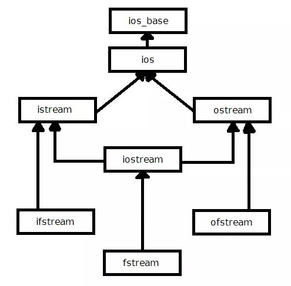
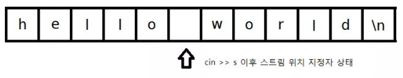
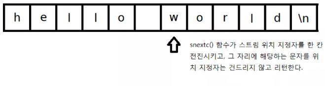

# c++ 입출력 라이브러리

c++ 라이브러리는 아래와 같이 클래스로 구성되어 있다.





## ios_base

- 입출력 라이브러리의 최상위 기반 클래스
- 스트림의 입출력 형식 관련 데이터 관리 **ex) 실수형 출력시 정밀도 설정, 정수형 출력시 10진수 또는 16진수 처리 설정**

## ios

- 스트림 버퍼 초기화, 스트림 버퍼란 데이터를 내보내거나 받아들이기 전에 임시로 저장하는 곳
- 하드웨어 읽어오는 부하가 크기 떄문에 한번에 많은 양을(예를 들어 512바이트) 한꺼번에 읽어서 스트림 버퍼에 저장
- 현재 입출력 작업의 상태도 처리
  - `eof` 함수는 파일을 읽다가 끝에 도달했는지 안했는지 확인하는 함수
  - `good` 함수는 현재 입출력 작업을 잘 수행할 수 있는지 확인하는 함수
  - 

# istream 클래스

`istream` 은 실제로 입력을 수행하는 클래스이다. 그리고 4가지 플래그가 존재한다.

- `goodbit` : 스트림에 입출력 작업이 가능할 때
- `badbit` : 스트림에 복구 불가능한 오류 발생시
- `failbit` : 스트림에 복구 가능한 오류 발생시
- `eofbit` : 입력 작업시에 EOF(End Of File) 도달시

## return cin

```c++
int c;
while(std::cin >> c)
```

위의 `while` 문을 분석하면,  먼저 `operator>>` 을 호출한다.

```c++
istream& operator>>(bool& val);

istream& operator>>(short& val);

istream& operator>>(unsigned short& val);

istream& operator>>(int& val);

istream& operator>>(unsigned int& val);

istream& operator>>(long& val);

istream& operator>>(unsigned long& val);

istream& operator>>(long long& val);

istream& operator>>(unsigned long long& val);

istream& operator>>(float& val);

istream& operator>>(double& val);

istream& operator>>(long double& val);

istream& operator>>(void*& val);
```

만약 위에 타입이 없으면, 외부로 오버로딩 된 외부 함수 연산자를 호출한다.

```c++
istream& operator>>(istream& in, std::string& s)

{
  // 구현한다
}
```

 아래 함수는 `ios` 객체를 `void*` 로 변환해 준다.  만약 `failbit` 와 `badbit` 가 모두 `off` 이면 `NULL` 포인터가 아닌 값을 리턴한다.

```c++
operator void*() const;
```

`operator>>` 는 입력된 타입이  `int`과 맞지 않으면 `failbit` 를 키면서 `cin` 을 리턴한다.  `while` 조건식에서 컴파일러는 적절한 타입 변환를 찾게 되고, `ios` 객체는 -> `void*(NULL)` -> `bool(false)` 로 2단 변환을 하고  `while`문을 빠져나온다.

여기서 `cin` 에 `fail` 비트가 켜진 상태이여서, 플래그를 초기화해벼리지 않는 한 `cin` 은 입력 받을 수 없게 된다. 이 문제를 해결하기 위해서는,

```c++
 if(std::cin.fail()){
        std::cin.clear(); // 플래그 초기화
        std::cin.ignore(100, '\n'); // 개행문자가 나올 때 까지 무시
    }
```

1. `fail` 함수로 `failbit`  또는 `badbit` 가 `true` 인지 확인하고 만약 `true` 이면 `true` 를 리턴
2. `clear()` 로 인자를 주지 않을 경우 플래그를 `goodbit` 로 초기화 
3. `ignore()` 로 최대 첫번째 인자 만큼(100), 두 번째 인자가 나올 때 까지('\n'), 버퍼에서 무시

따라서 버퍼에 남아 있는 문자들을 다 지워준다.


## 형식 플래그(format 'flag') 와 조작자(Manipulator)

```c++
std::cin.setf(ios_base::hex, ios_base::basefield)
```

위의 함수는 입력 받은 10진수를 16진수로 변환한다. 

몇 진법으로 수를 처리할지 보관하는 `basefield` 의 값을 초기화 하고, 16진법 (`hex`) 플래그를 적용시킨것이다. 

```c++
std::cin >> hex >> t;
```

위 방법으로는 `hex` 가 `cin` 에서 수를 받는 방식을 바꿔버렸다. `hex` 와 같이, 스트림을 조작하여 입력 혹은 출력 방식을 바꿔주는 함수를 조작자라고 한다.


## 스트림 버퍼

`streambuf` 클래스는 스트림에 대한 가장 기본적인 제어를 담당한다.

`streambuf` 클래스는 스트림의 상태를 나타내기 위해서 세 개의 포인터를 정의한다. 먼저 버퍼의 시작 부분을 가리키는 시작 포인터와, 다음으로 읽을 문자를 가리키고 있는 포인터 (우리가 흔히 말하는 스트림 위치 지정자), 그리고 버퍼의 끝 부분을 가리키고 있는 끝 포인터가 있다. `streambuf` 클래스는 입력 버퍼와 출력 버퍼를 구분해서 각각 `get area` 와 `put area` 라 부르는데, 이에 따라 각각을 가리키는 포인터도 `g` 와 `p` 를 붙여서 표현하게 된다.

```c++
#include <iostream>
#include <string>

int main() {
    std::string s;
    std::cin >> s;

    char peek = std::cin.rdbuf()->snextc();
    std::cout << peek << std::endl;
    std::cout << s << std::endl;
    std::cin >> s;
    std::cout << s << std::endl;

    return 1;
}
```

`cin` 의 `rdbuf` 를 호출하면, `cin` 객체가 입력을 수행하고 있던 `streambuf` 객체를 가리키는 포인터를 리턴한다. 오직 입력만 수행하기 때문에 `get area` 만 있다.

`snextc` 함수는 스트림 위치 지정자를 한칸 전진시킨 후, 그 자리에 해당하는 문자를 엿본다.




`std::cin >> s` 를 한 이후의 `streambuf` 의 상태 이다. 문자열의 경우 공백문자가 나오기 전 까지 읽어들이기 때문에 위와 같은 상태가 된다, `snextc()` 함수를 호출하면,




한 칸 전진하고 `w` 를 가리키고 리턴한다. 이때 `snextc` 함수는 스트림 위치 지정자를 건드리지 않는다.


> 출처
>
> https://modoocode.com/135

