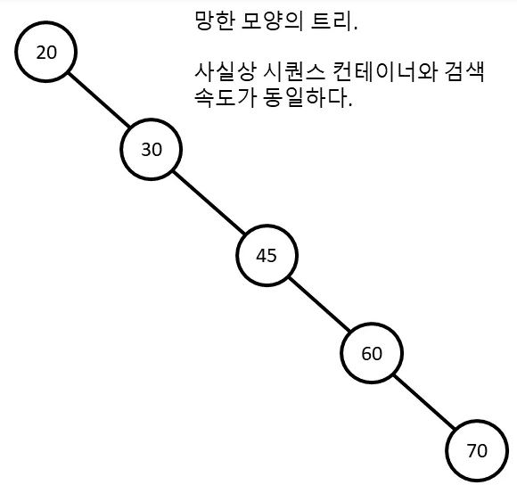
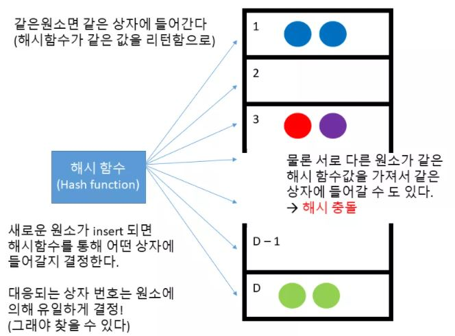

# 연관 컨테이너(associative container)

키(key) - 값(value) 구조를 가진 컨테이너이다.

- 키의 존재 유무를 알고싶다면  : **셋(set), 멀티셋(multiset)**
- 값의 값을 알고싶다면 : **맵(map) 과 멀티맵(multimap)**

을 사용하면 된다.


# 셋(set)

## 1. 특징

- 원소를 추가할 때는 `insert` 함수를 사용하면 된다. 하지만 `index`를 지정할 수 없다.
- 셋에 원소를 추가하거나 지우는 작업은 **O(logN)**에 처리된다.
- 반복자 타입은 `BidirectionalIterator` 이다. 즉 임의의 원소를 접근할 수 없고 순차적으로 접근해야한다.
- `sort` 된 상태로 원소들이 유지하며 추가된다.
- `find` 함수가 제공되며, 원소가 있는지 없는지 판단해준다. 만약 없으면 `end` 함수를 리턴한다.
- 검색 또한 정렬된 상태를 유지하기 때문에 작업은 **O(logN)** 처리한다.
- 중복된 원소들이 없다.


## 2. 구조

셋은 내부적으로 트리 구조로 구성되어 있다. 트리의 노드들의 특징은 다음과 같다.

- 왼쪽에 오는 모든 노드들은 나보다 작다
- 오른쪽에 있는 모든 노드들은 나보다 크다


만약 찾는 값이 **33** 이면 과정은,

1. 루트 노드 : 20 < **33** → 오른쪽으로 이동
2. 30 노드 : 30 < **33** → 오른쪽으로 이동
3. 45 노드 : 45 > **33** → 왼쪽으로 이동
4. 33 노드 : 33 == **33** → 값 발견

이러한 과정으로 노드들을 탐색한다. 따라서 최대 탐색 횟수는 트리의 높이에 비례한다. 노드 **60** 또는 **33** 의 경우에는 총 4번의 비교가 필요하다. 따라서 최대한 모든 노드들을 꽉 채우는것이 중요하다. 예를 들어서





이러한 노드는 시퀀스 컨테이너와 검색 속도가 동일한다. 위와 같은 노드 즉, 한쪽으로 아예 치우쳐버린 트리를 균형잡히지 않는 트리(unbalanced tree) 라고 부른다. 실제 셋의 구현을 보면 위와 같은 상황이 발생하지 않도록 앞서 말한 두개의 단순한 규칙보다 더많은 규칙들을 도입해서 트리를 항상 균형 잡히도록 유지하고 있다.


따라서 셋의 구현상 **O(logN)** 으로 원소를 검색할 수 있따는 것이 보장된다.


```c++
#include <iostream>
#include <set>

template <typename T>
std::ostream& operator<<(std::ostream& os, std::set<T> s){
    os << "[ ";
    for(const auto& element : s) os << element << " ";
    os << "]" << std::endl;
    return os;
}

int main() {

    std::set<int> s;
    // 추가는 insert 함수로 인덱스을 지정할 수 없다.
    s.insert(0);
    s.insert(0); // 중복허용x
    // 오름차순으로 정렬되어 있다.
    s.insert(10);
    s.insert(5);
    std::cout << s;
    // output : [ 0 5 10 ]

    // find 함수사용 가능 -> 없으면 end() 리턴한다.
    if(s.find(20) == s.end()) std::cout << "원소 없음" << std::endl;
    else std::cout << "원소 있음" << std::endl;
    // output : 원소 없음

    if(s.find(0) == s.end()) std::cout << "원소 없음" << std::endl;
    else std::cout << "원소 있음" << std::endl;
    // output : 원소 있음


    return 0;
}
```


## 3. Class Set

`Class Type` 의 셋을 만들기 위해서는 `operator<` 또는 함수객체가 필요하다.


### 1) operator< 사용

```c++
class Todo{
    int priority;  // 중요도. 높을 수록 급한것!
    std::string job_desc;

public:
    Todo(int priority, std::string job_desc) : priority(priority), job_desc(job_desc) {}
    bool operator<(const Todo& t) const{
        if(priority == t.priority) return job_desc < t.job_desc;
        return priority > t.priority;
    }
    friend std::ostream& operator<<(std::ostream& os, const Todo& t);

};
```

`operatoc<` 을 받기 위해서는 레퍼런스를 `const` 로 선언하고 `const` 함수로 받아야한다. 왜냐하면 셋 내부적으로 정렬 시에 상수 반복자를 사용하기 때문이다.

만약 중요도가 같다는 논리연산자(`priority == t.priority`) 가 없으면 둘 다 `false`  이므로, **두 개의 원소는 같은 것이라 생각**해서 추가 되지 않는다.  따라서 `operator<` 조건을 지켜야한다. 조건은 다음과 같다.

- `A < A` 는 거짓
- `A < B != B < A`
- `A < B` 이고 `B < C` 이면 `A < C`
- `A == B` 이면 `A < B` 와 B `< A` 둘 다 거짓
- `A == B` 이고 `B == C` 이면 `A == C`

위와 같은 조건을 만족하는 `<` 연산자는 *strict weak ordering* 을 만족한다고 한다.


### 2) 함수 객체 사용

```cpp
template <class Key, class Compare = std::less<Key>,
          class Allocator = std::allocator<Key>  
          >
class set;
```

`set` 두번 째 인자에 함수객체를 넘겨주면 된다. 따라서 함수객체를 선언하고,

```cpp
truct TodoCmp {
  bool operator()(const Todo& t1, const Todo& t2) const {
    if (t1.priority == t2.priority) {
      return t1.job_desc < t2.job_desc;
    }
    return t1.priority > t2.priority;
  }
};
```

```cpp
std::set<Todo, TodoCmp> todos;
```

위와 같이 넘겨주면 된다.


## 4. Big-O

셋은 원소의 삽입과 삭제를 O(logN) 원소의 탐색도 O(logN)에 수행하는 자료 구조이다


# 맵(map)

맵은 셋과 거의 똑같은 자료구조이다. 다만 키에 대응되는 값(value)를 보관한다.


## 1. insert, []

`insert` 를 사용하면 `std::pair` 객체를 만들어야 한다.

```c++
template <class T1, class T2>
struct std::pair {
  T1 first;
  T2 second;
};
```

`STL` 에서는 `std::make_pair` 함수를 제공해주므로 `std::pair` 객체를 만들어서 알아서 리턴해준다.

또한 `[]` 을 사용해도 된다. 주의점은 `[]` 에 대입되는 값이 없으면 `default` 값으로 `value` 가 채워진다.

```cpp
#include <map>
#include <string>

int main() {
    std::map<std::string, int> m;
    m.insert(std::make_pair("a",1));
    m.insert(std::make_pair("b",2));
    m["c"] = 3;
    m["d"]; // defalut 값으로 0이 value 값에 채워진다.
    return 0;
}
```

`insert` 함수는 같은 `key` 값이 `insert` 되면 맨 처음 값이 추가되고 나머지 값들은 무시된다.


## 2. for

`iterator`  또는 범위 기반 `for` 문으로 사용하면된다.

```c++
//iterator
std::map<std::string ,int>::iterator iter;
for(iter = m.begin(); iter != m.end(); ++iter)
	std::cout << iter->first << " : " << iter->second << std::endl;

// 범위 기반 for
for(const auto& pair : m)
    std::cout << pair.first << " : " << pair.second << std::endl;
```


## 3. find

만약 `map` 에 지정된 값을 찾고 싶다면 간단히 `[]` 연산자를 사용하면 된다. 

주의점은 만약 해당하는 `key` 값이 없으면 앞에서 `default` 값을 추가하고 반환한다.

```c++
#include <map>
#include <string>


int main() {
    std::map<std::string, int> m;
    m.insert(std::make_pair("a",1));
    m.insert(std::make_pair("b",2));
    m["c"] = 3;

    std::cout << "c : " << m["c"] << std::endl; 
    // [output] c : 3
    std::cout << "e : " << m["e"] << std::endl;
    // [output] e : 0
}
```

따라서, 원소가 있는지 없는지 `find` 함수로 이용하면 된다.

```c++
#include <map>
#include <string>


int main() {
    std::map<std::string, int> m;
    m.insert(std::make_pair("a",1));
    m.insert(std::make_pair("b",2));
    m["c"] = 3;

    if(m.find("c") == m.end()){
        std::cout << "원소 없음";
    }else{
        std::cout << "원소 있음";
    }
}
```


# 멀티셋(multiset)과 멀티맵(multimap)

중복을 허용하는 `set` 과 `map` 이다.

`map` 은 `[]` 연산자를 제공하지 않는다. 만약에

```c++
std::cout << m.find(1)->second << std::endl;
```

`find` 함수를 사용하면 1 에 해당하는 `value` 값이 3개라면 어떤 값을 리턴할까? C++ 표준에서는 무엇을 리턴하라고 정해놓치 않았다. 즉, 해당되는 값들 중 아무 거나 리턴해도 상관없다.

 

## equal_range 

`equal_range` 함수는 인자로 멀티탭의 키를 받은 뒤에, 이 키에 대응되는 원소들의 반복자들 중에서 시작과 끝 바로 다음을 가리키는 반복자를 `std::pair` 객체로 만들어서 리턴한다.

```c++
#include <iostream>
#include <map>
#include <string>


int main() {
    std::multimap<int, int> m;
    m.insert(std::make_pair(1,1));
    m.insert(std::make_pair(1,2));
    m.insert(std::make_pair(1,3));
    m.insert(std::make_pair(1,1));
    m.insert(std::make_pair(2,1));
    std::multimap<int, int>::iterator range = m.equal_range(1).first;
    for(; range != m.equal_range(1).second; ++range)
        std::cout << range->first << " : " << range->second << std::endl;
    
    return 0;
}
```


# 정렬되지 않은 셋과 맵(unordered_set, unordered_map)

정렬이 되어 있지 않고 `insert`, `erase`, `find` 모두가 **O(1)** 으로 수행된다.


## 1. 해쉬 함수 (Hash function)

해쉬 함수란 임의의 크기의 데이터를 고정된 크기의 데이터로 대응시켜주는 함수이다. 고정된 크기의 데이터는 보통 일정 범위의 정수값을 의미한다.





`unordered_set` 과 `unordered_map` 의 경우, 해시함수는 1부터 D까지(=상자의 수)까지의 값을 반환하고 그 해시값(해시 함수로 계산한 값)을 원소를 저장할 상자의 번호로 삼게 된다.

해시 함수의 가장 중요한 성질은, 만약에 **같은 원소를 해시 함수에 전달한다면 같은 해시값을 리턴**한다는 점, 이 덕분에 원소의 탐색을 빠르게 수행할 수 있다.

예를 들어 사용자가 파란공이 `unordered_set` 에 들어있는지 아닌지 확인하면, 파란공을 해시 함수에 대입하면 1을 리턴한다. 따라서 1번 상자를 살펴보면 파란공이 있는지 알 수 있다. 따라서 파란공은 `unordered_set` 에 이미 존재한다. 해시 함수가 해시값 계산을 상수 시간에 처리 하므로 따라서 `unordered_set` 과 `unordered_map` 모두 탐색을 상수 시간에 처리한다.


만약 3번 처럼 다른 원소임에도 불구하고 같은 해시값을 갖는 경우에는 **해시 충돌(hash collision)** 이라고 한다. 만약 보라색 공이 셋에 포함되어있는지 확인하려면 먼저 보라색 공의 해시값을 계산하고 해당하는 상자에 있는 모든 원소들을 탐색해보아야한다. 이렇게 최악의 경우에는 탐색이 O(N) 으로 실행된다.

결론적으로  `unordered_set` 과 `unordered_map` 의 경우 평균적으로 O(1) 시간으로 원소의 삽입/탐색을 수행할 수 있지만 최악의 경우 O(N) 으로 수행될 수 있다(그냥 `set` 과 `map` 의 경우 평균도 O(log N) 최악의 경우에도 O(log N) 으로 실행)

이 때문에 보통의 경우에는 그냥 안전하게 맵이나 셋을 사용하고, 만약에 최적화가 매우 필요한 작업일 경우에만 해시 함수를 잘 설계해서 `unordered_set` 과 `unordered_map` 을 사용하는 것이 좋다.

또한 처음부터 많은 개수의 상자를 사용할 수 없기 때문에(메모리낭비) 상자의 개수는 삽입되는 원소가 많아짐에 따라 점진적으로 늘어난다. 문제는 상자의 개수가 늘어나면 해시 함수를 바꿔야 하기 때문에(더 많은 값들을 해시값으로 반환할 수 있도록) 모든 원소들을 처음부터 끝 까지 다시 `insert` 해야한다. 이를 `rehash` 라고 하며 **O(N)** 의 시간이 걸린다.


## 2. Big-O

- `insert`, `erase`, `find` 평균적으로 **O(1)** 최악의 경우(hash collision)는 **O(N)**
- `rehash` 되는 경우 **O(N)**  


## 3. Class unordered

unordered 타입을 class로 하려면 해시 함수를 직접 만들어줘야 한다. `operator==` 도 필요하다(해시 충돌 발생 시에 상자안에 있는 원소들과 비교를 해야하기 때문)


### 해시 함수(hash function)

```c++
// Todo 해시 함수를 위한 함수객체(Functor)
// 를 만들어줍니다!
namespace std {
template <>
struct hash<Todo> {
  size_t operator()(const Todo& t) const {
    hash<string> hash_func;

    return t.priority ^ (hash_func(t.job_desc));
  }
};
}  // namespace std
```

C++ STL 에서는 기본적인 type(int, std::string 등)은  `hash` 함수로 해시값을 얻을수 있다. 또한, `hash` 클래스가 `namespace std` 안에 정의되어 있냐면 (이미 위에서 `using namespace std` 를 했음에도 불구하고), 특정 `namespace` 안에 새로운 클래스/함수를 추가하기 위해서는 위처럼 명시적으로 `namespace (이름)` 를 써줘야만 한다.


마지막으로, 해시 충돌이 일어나면 방지하는 `operator==` 연산자를 마지막으로 추가해주면 된다.

```c++
bool operator==(const Todo& t) const {
  if (priority == t.priority && job_desc == t.job_desc) return true;
  return false;
}
```


## 4. 효율적인 사용법

- 데이터의 존재 유무 만 궁금할 경우 → `set`

- 중복 데이터를 허락할 경우 → `multiset` (`insert, erase, find` 모두 O*(log*N*). 최악의 경우에도 *O*(log*N*))

- 데이터에 대응되는 데이터를 저장하고 싶은 경우 → `map`

- 중복 키를 허락할 경우 → `multimap` (`insert, erase, find` 모두 O*(log*N*). 최악의 경우에도 O*(log*N*))

- 속도가 매우매우 중요해서 최적화를 해야하는 경우 → `unordered_set`, `unordered_map`

  ([insert](https://modoocode.com/238), [erase](https://modoocode.com/240), [find](https://modoocode.com/261) 모두 O*(1). 최악의 경우엔 O*(*N*) 그러므로 해시함수와 상자 개수를 잘 설정해야 한다!)
