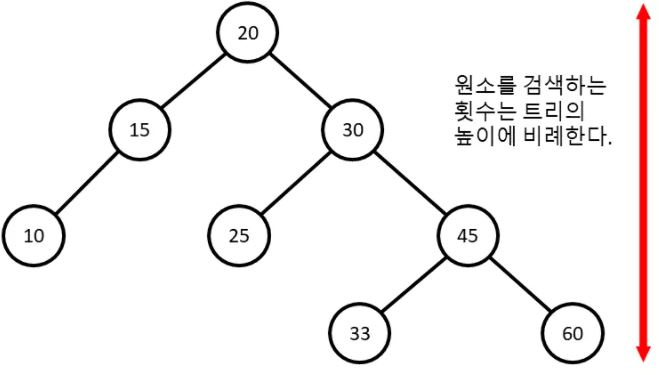

# 연관 컨테이너(associative container)

키(key) - 값(value) 구조를 가진 컨테이너이다.

- 키의 존재 유무를 알고싶다면  : **셋(set), 멀티셋(multiset)**
- 값의 값을 알고싶다면 : **맵(map) 과 멀티맵(multimap)**

을 사용하면 된다.


# 셋(set)

## 1. 특징

- 원소를 추가할 때는 `insert` 함수를 사용하면 된다. 하지만 `index`를 지정할 수 없다.
- 셋에 원소를 추가하거나 지우는 작업은 **O(logN)**에 처리된다.
- 반복자 타입은 `BidirectionalIterator` 이다. 즉 임의의 원소를 접근할 수 없고 순차적으로 접근해야한다.
- `sort` 된 상태로 원소들이 유지하며 추가된다.
- `find` 함수가 제공되며, 원소가 있는지 없는지 판단해준다. 만약 없으면 `end` 함수를 리턴한다.
- 검색 또한 정렬된 상태를 유지하기 때문에 작업은 **O(logN)** 처리한다.
- 중복된 원소들이 없다.


## 2. 구조

셋은 내부적으로 트리 구조로 구성되어 있다. 트리의 노드들의 특징은 다음과 같다.

- 왼쪽에 오는 모든 노드들은 나보다 작다
- 오른쪽에 있는 모든 노드들은 나보다 크다





만약 찾는 값이 **33** 이면 과정은,

1. 루트 노드 : 20 < **33** → 오른쪽으로 이동
2. 30 노드 : 30 < **33** → 오른쪽으로 이동
3. 45 노드 : 45 > **33** → 왼쪽으로 이동
4. 33 노드 : 33 == **33** → 값 발견

이러한 과정으로 노드들을 탐색한다. 따라서 최대 탐색 횟수는 트리의 높이에 비례한다. 노드 **60** 또는 **33** 의 경우에는 총 4번의 비교가 필요하다. 따라서 최대한 모든 노드들을 꽉 채우는것이 중요하다. 예를 들어서


이러한 노드는 시퀀스 컨테이너와 검색 속도가 동일한다. 위와 같은 노드 즉, 한쪽으로 아예 치우쳐버린 트리를 균형잡히지 않는 트리(unbalanced tree) 라고 부른다. 실제 셋의 구현을 보면 위와 같은 상황이 발생하지 않도록 앞서 말한 두개의 단순한 규칙보다 더많은 규칙들을 도입해서 트리를 항상 균형 잡히도록 유지하고 있다.


따라서 셋의 구현상 **O(logN)** 으로 원소를 검색할 수 있따는 것이 보장된다.


```c++
#include <iostream>
#include <set>

template <typename T>
std::ostream& operator<<(std::ostream& os, std::set<T> s){
    os << "[ ";
    for(const auto& element : s) os << element << " ";
    os << "]" << std::endl;
    return os;
}

int main() {

    std::set<int> s;
    // 추가는 insert 함수로 인덱스을 지정할 수 없다.
    s.insert(0);
    s.insert(0); // 중복허용x
    // 오름차순으로 정렬되어 있다.
    s.insert(10);
    s.insert(5);
    std::cout << s;
    // output : [ 0 5 10 ]

    // find 함수사용 가능 -> 없으면 end() 리턴한다.
    if(s.find(20) == s.end()) std::cout << "원소 없음" << std::endl;
    else std::cout << "원소 있음" << std::endl;
    // output : 원소 없음

    if(s.find(0) == s.end()) std::cout << "원소 없음" << std::endl;
    else std::cout << "원소 있음" << std::endl;
    // output : 원소 있음


    return 0;
}
```


## 3. Class Set

`Class Type` 의 셋을 만들기 위해서는 `operator<` 또는 함수객체가 필요하다.


### 1) operator< 사용

```c++
class Todo{
    int priority;  // 중요도. 높을 수록 급한것!
    std::string job_desc;

public:
    Todo(int priority, std::string job_desc) : priority(priority), job_desc(job_desc) {}
    bool operator<(const Todo& t) const{
        if(priority == t.priority) return job_desc < t.job_desc;
        return priority > t.priority;
    }
    friend std::ostream& operator<<(std::ostream& os, const Todo& t);

};
```

`operatoc<` 을 받기 위해서는 레퍼런스를 `const` 로 선언하고 `const` 함수로 받아야한다. 왜냐하면 셋 내부적으로 정렬 시에 상수 반복자를 사용하기 때문이다.

만약 중요도가 같다는 논리연산자(`priority == t.priority`) 가 없으면 둘 다 `false`  이므로, **두 개의 원소는 같은 것이라 생각**해서 추가 되지 않는다.  따라서 `operator<` 조건을 지켜야한다. 조건은 다음과 같다.

- `A < A` 는 거짓
- `A < B != B < A`
- `A < B` 이고 `B < C` 이면 `A < C`
- `A == B` 이면 `A < B` 와 B `< A` 둘 다 거짓
- `A == B` 이고 `B == C` 이면 `A == C`

위와 같은 조건을 만족하는 `<` 연산자는 *strict weak ordering* 을 만족한다고 한다.


### 2) 함수 객체 사용

```cpp
template <class Key, class Compare = std::less<Key>,
          class Allocator = std::allocator<Key>  
          >
class set;
```

`set` 두번 째 인자에 함수객체를 넘겨주면 된다. 따라서 함수객체를 선언하고,

```cpp
truct TodoCmp {
  bool operator()(const Todo& t1, const Todo& t2) const {
    if (t1.priority == t2.priority) {
      return t1.job_desc < t2.job_desc;
    }
    return t1.priority > t2.priority;
  }
};
```

```cpp
std::set<Todo, TodoCmp> todos;
```

위와 같이 넘겨주면 된다.


## 4. Big-O

셋은 원소의 삽입과 삭제를 O(logN) 원소의 탐색도 O(logN)에 수행하는 자료 구조이다


# 맵(map)

맵은 셋과 거의 똑같은 자료구조이다. 다만 키에 대응되는 값(value)를 보관한다.


## 1. insert, []

`insert` 를 사용하면 `std::pair` 객체를 만들어야 한다.

```c++
template <class T1, class T2>
struct std::pair {
  T1 first;
  T2 second;
};
```

`STL` 에서는 `std::make_pair` 함수를 제공해주므로 `std::pair` 객체를 만들어서 알아서 리턴해준다.

또한 `[]` 을 사용해도 된다. 주의점은 `[]` 에 대입되는 값이 없으면 `default` 값으로 `value` 가 채워진다.

```cpp
#include <map>
#include <string>

int main() {
    std::map<std::string, int> m;
    m.insert(std::make_pair("a",1));
    m.insert(std::make_pair("b",2));
    m["c"] = 3;
    m["d"]; // defalut 값으로 0이 value 값에 채워진다.
    return 0;
}
```

`insert` 함수는 같은 `key` 값이 `insert` 되면 맨 처음 값이 추가되고 나머지 값들은 무시된다.


## 2. for

`iterator`  또는 범위 기반 `for` 문으로 사용하면된다.

```c++
//iterator
std::map<std::string ,int>::iterator iter;
for(iter = m.begin(); iter != m.end(); ++iter)
	std::cout << iter->first << " : " << iter->second << std::endl;

// 범위 기반 for
for(const auto& pair : m)
    std::cout << pair.first << " : " << pair.second << std::endl;
```


## 3. find

만약 `map` 에 지정된 값을 찾고 싶다면 간단히 `[]` 연산자를 사용하면 된다. 

주의점은 만약 해당하는 `key` 값이 없으면 앞에서 `default` 값을 추가하고 반환한다.

```c++
#include <map>
#include <string>


int main() {
    std::map<std::string, int> m;
    m.insert(std::make_pair("a",1));
    m.insert(std::make_pair("b",2));
    m["c"] = 3;

    std::cout << "c : " << m["c"] << std::endl; 
    // [output] c : 3
    std::cout << "e : " << m["e"] << std::endl;
    // [output] e : 0
}
```

따라서, 원소가 있는지 없는지 `find` 함수로 이용하면 된다.

```c++
#include <map>
#include <string>


int main() {
    std::map<std::string, int> m;
    m.insert(std::make_pair("a",1));
    m.insert(std::make_pair("b",2));
    m["c"] = 3;

    if(m.find("c") == m.end()){
        std::cout << "원소 없음";
    }else{
        std::cout << "원소 있음";
    }
}
```


# 멀티셋(multiset)과 멀티맵(multimap)

중복을 허용하는 `set` 과 `map` 이다.

`map` 은 `[]` 연산자를 제공하지 않는다. 만약에

```c++
std::cout << m.find(1)->second << std::endl;
```

`find` 함수를 사용하면 1 에 해당하는 `value` 값이 3개라면 어떤 값을 리턴할까? C++ 표준에서는 무엇을 리턴하라고 정해놓치 않았다. 즉, 해당되는 값들 중 아무 거나 리턴해도 상관없다.

 

## equal_range 

`equal_range` 함수는 인자로 멀티탭의 키를 받은 뒤에, 이 키에 대응되는 원소들의 반복자들 중에서 시작과 끝 바로 다음을 가리키는 반복자를 `std::pair` 객체로 만들어서 리턴한다.

```c++
#include <iostream>
#include <map>
#include <string>


int main() {
    std::multimap<int, int> m;
    m.insert(std::make_pair(1,1));
    m.insert(std::make_pair(1,2));
    m.insert(std::make_pair(1,3));
    m.insert(std::make_pair(1,1));
    m.insert(std::make_pair(2,1));
    std::multimap<int, int>::iterator range = m.equal_range(1).first;
    for(; range != m.equal_range(1).second; ++range)
        std::cout << range->first << " : " << range->second << std::endl;
    
    return 0;
}
```


# 정렬되지 않은 셋과 맵(unordered_set, unordered_map)

