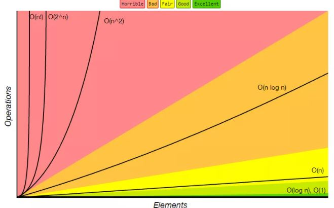
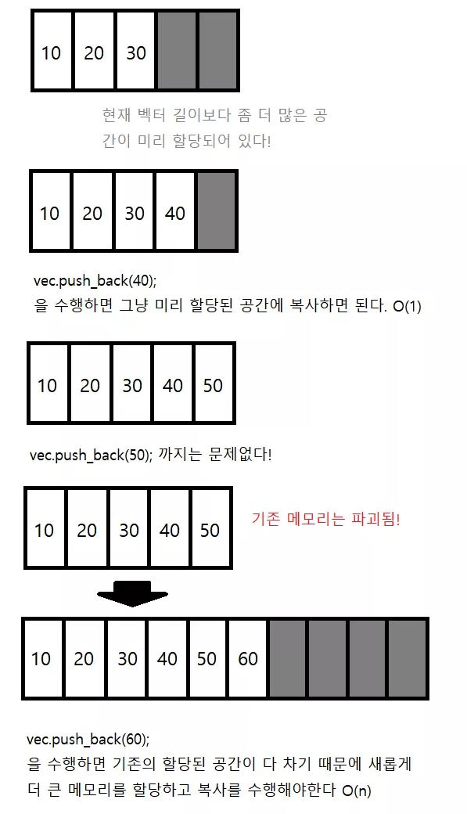
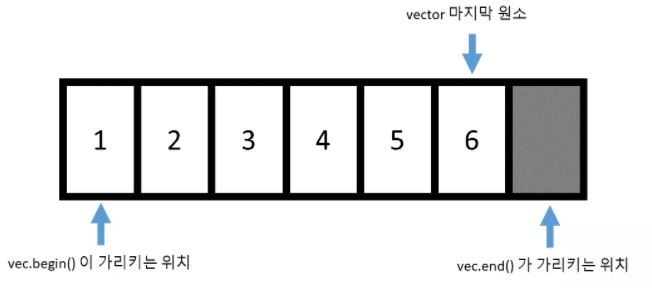
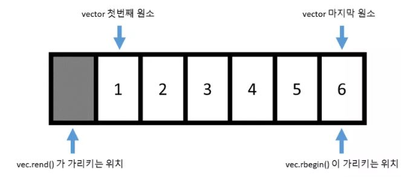
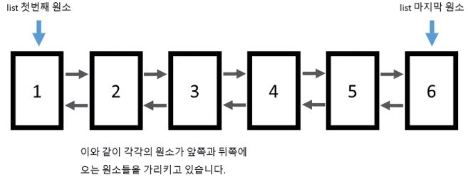
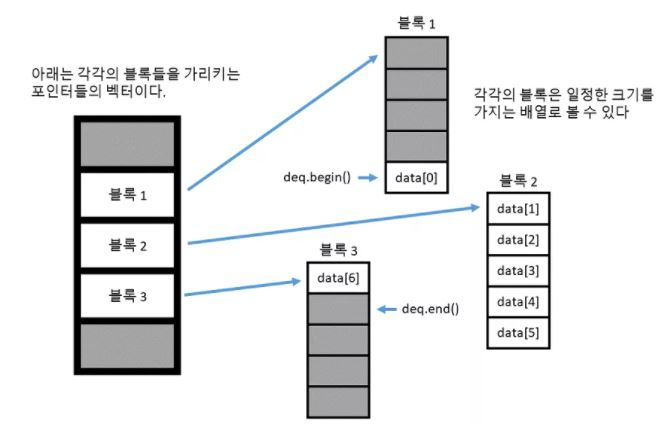
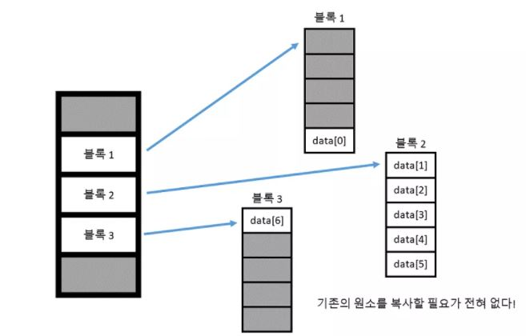

# C++ 표준 템플릿 라이브러리(Standard Template Library - STL)

크게 3가지 종류가 있다.

- 임의 타입의 객체를 보관할 수 있는 컨테이너 (container)
- 컨테이너에 보관된 원소에 접근할 수 있는 반복자 (iterator)
- 반복자들을 가지고 일련의 작업을 수행하는 알고리즘 (algorithm)


# 시간복잡도(Time Complexity)

알고리즘의 절대적인 실행 시간을 나타내는 것이 아닌 알고리즘을 수행하는데 연산들이 몇 번 이루어지는 지를 숫자로 표기한다.

> 연산의 종류 : 산술, 대입, 비교, 이동

연산의 개수를 입력한 데이터의 개수 n의 함수로 나태낸 것을 시간 복잡도 함수이며, 수식으로는 **T(n)** 이라고 표기한다.


## 시간 복잡도 예시

```c++
int sum = 0; // 대입 연산(sum) : 1
for(int i = 0; i < n; i++){ // 대입 연산(i) : 1
    for(int j = 0; j < n; j++){ // 대입연산(j) : 1 
        sum += 1; // 대입연산(sum) n*n, 덧셈연산(sum) n*n
    }
}
// 총 대입연산 : n*n+3
// 총 덧셈연산 : n*n
// 전체 연산 횟수 : 2n^2+3
```

전체 연산 횟수는 2n^2+3 이므로, (2n^2+3)t 만큼의 시간이 필요하다.


## 빅오 표기법(bIg-oh notation)

시간 복잡도 함수에서 상대적으로 불필요한 연산을 제거하여 알고리즘의 분석을 조금 더 간편한게 할 목적으로 시간 복잡도를 표기하는 방법이다. 

**최고 차항**만을 나타낸다. 왜냐하면 N이 엄청 커지게 되면 최고 차항 말고는 그닥 의미가 없기 때문이다.





# 공간복잡도(Space Complexity)

알고리즘에서 사용하는 메모리양을 나타낸다.

공간 복잡도는 보조공간(Auxiliary Space)과 입력 공간(input size)을 합친 포괄적인 개념이다.

보조공간은 알고리즘이 실행되는 동안 사용하는 임시 공간이다.


```c++
int sum(int a[], int n)
{
  int x = 0;		
  for(int i = 0; i < n; i++) {
    x  = x + a[i];
  }
  return(x);
}
```

- `int a[]` : 4*n byte (입력 공간)
- `int n` : 4 byte(입력 공간)
- `int x` : 4 byte(보조 공간)
- `int i` : 4 byte(보조 공간)

총 4n+12에 메모리를 요구한다. 메모리가 입력 값에 따라 선형적으로 증가하기 때문에 공간 복잡도는 O(n)이 된다.


# STL - 벡터 (std::vector)

**시퀀스 컨테이너(sequence container)** : `vector`, `list`, `deque` 중에 하나이고, 가변길이 배열이다. 

- 임의의 위치 원소 접근(`[], at` ) : O(1)

- 맨 뒤에 원소 추가 및 제거 (`push_back, pop_back`) : amortized O(1) 

  - amortized 란?

    

  - 평균적으로 O(1) 이지만, `capacity` 를 초과하면 기존 메모리를 파괴하고 다시 복사 되므로 O(n) 이다.

- 임의의 위치 원소 추가 및 제거(`insert`, `erase` ) : O(n)


# 반복자(iterator)

반복자는 컨테이너에 `iterator` 멤버 타입으로 정의 되어 있다. 원소의 값을 보고 싶으면,

```c++
std::cout << *iter << std::endl;
```

여기서 `iter`은 실제 포인터가 아니고 `*` 연산자를 오버로딩해서 마치 포인터 처럼 동작하게 만든 것이다. `*` 연산자는 `iter`이 가리키는 원소의 레퍼런스를 리턴한다.


## 1. begin() , end( ) 

`vector` 의 경우 반복자를 얻기 위해서는 `begin()` 함수와 `end()` 함수를 이용하면 된다.



`end()` 함수가 마지막 원소 뒤를 가르키는 이유는  `vector` 가 비어 있다는 표현은 `begin() == end()` 인데, 만약에 `end()` 함수가 마지막 원소를 가리키면 비어있는 벡터를 표현할 수 없게 된다.


## 2. template

```c++
template <typename T>
void PrintV(std::vector<T>& v){
    // 전체 출력
    for(typename std::vector<T>::iterator iter = v.begin(); iter != v.end(); ++iter){
        std::cout << *iter << std::endl;
    }
```

템블릿 버전의 경우에는 `typename` 을 추가해줘야한다. 그 이유는, `iterator` 가 `std::vector<T>` 의 의존 타입이기 때문이다.


## 3. erase(), insert()

`iterator` 을 활용해서 사용하는 방법은 아래와 같다.

```c++
vector<int> v;
v.push_back(0);
v.push_back(1);
v.push_back(2);

// v[1] 자리에 15 추가
v.insert(v.begin()+1, 15);

// v[3] 제거
v.erase(v.begin()+3);
```

주의점은,

```c++
for(std::vector<int>::iterator iter = v.begin(); iter != v.end(); ++iter){
    if(*iter == 20){
        v.erase(iter);
    }
}
```

실행하면 런타임 오류가 발생한다**(Clion 에서는 오류가 발생하지 않는다)** . 왜냐하면, 

컨테이너에 원소를 추가하거나 제거하게 되면 기존에 사용하였던 모든 반복자들을 사용할 수 없게 된다. 따라서 `iter != v.end() ` 는 성립 되지 않아서 무한루프에 빠지게 된다. 


## 4. const, reverse

`const iterator` 를 사용하고 싶으면  `cbegin()` 과 `cend()` 함수를 사용하면 된다.

```c++
std::vector<int>::const_iterator begin_citer = vec.cbegin();
std::vector<int>::const_iterator end_citer = vec.cend();
```


역반복자(reverse iterator)를 사용하고 싶으면 아래 예제처럼 사용하면 된다.

```c++
std::vector<int> vec = {1,2,3,4,5,6,7,8,9,10};
for(std::vector<int>::reverse_iterator riter = vec.rbegin(); riter != vec.rend(); ++riter) 
    std::cout << *riter << " ";

```

구조는 아래와 같다.



만약 `상수 역반복자` 을 사용하고 싶으면 타입은 `const_reverse_iterator` 타입이고, `crbegin()` 과 `crend()` 로 얻을수 있다.


# 범위 기반 for문(range based for loop)

`c++ 11` 에서 부터는 간단하게 표현할 수 있는 **범위 기반(range-based) for 문** 제공된다.

```c++
std::vector<int> vec = {1,2,3,4,5,6,7,8,9,10};
for(int i : vec) 
    std::cout << i << std::endl;
```

`const ` , `reference` , `auto` 키워드로 사용도 가능하다.


# 리스트(list)

양방향 연결 구조를 가진 자료형이다.





특징은 다음과 같다.

- 임의의 위치에 있는 원소에 바로 접근할 수 없다. 따라서, `[]` , `at` 함수가 아예 정의되어 있지 않다.
- 원하는 위치 앞과 뒤에 있는 링크값만 바꿔주면 되기 때문에, 임의의 위치에 원소를 추가하거나 제거하는 작업은 **O(1)** 으로 수행된다.
- 메모리 상에서 원소들이 연속적으로 존재하지 않아서 증가, 감소 연산자는 단항연산자(`++` , `--`) 밖에 못한다.
- 반복자 타입은 `BidirectionalIterator ` 이다.
- **원소를 지워도 반복자가 무효화 되지 않는다**. 왜냐하면, 각 원소들의 주소값들은 바뀌지 않기 때문이다.


# 덱(deque - double ended queue)

## 1. 특징

- 임의의 원소 접근, 맨 뒤/앞에 원소 추가/제거는**O(1)**
- 임의의 위치에 있는 원소 제거/추가 하는 작업은 **O(n) 하지만, 벡터보다는 속도가 빠르다.**
- 원소들이 실제로 메모리 상에서 연속적으로 존재하지 않는다.
- 원소들이 어디에 저장되어 있는지에 대한 정보를 보관하기 위해 추가적인 메모리가 필요하다. 따라서 덱은 실행속도를 위해 메모리를(많이) 희생하는 컨테이너이다.


## 2. 구조





원소들이 메모리에 연속되어 존재하는 것이 아니라 일정 크기로 잘려서 각각의 블록 속에 존재한다. 블록들은 메모리 상에 어느 곳에 위치하여 있는지 저장하기 위해서 각각의 블록들의 주소를 저장하는 벡터가 필요하다. 또한, 기존 벡터와 다르게 앞뒤로 공간을 남겨놓아서 맨 앞과 맨 뒤에 **O(1)** 의 속도로 `insert` 및 `erase` 를 수행할 수 있다.

### 벡터보다 원소 삽입 작업이 빠른 이유





원소가 추가되면 `vector` 와 다르게 기존의 원소를 복사할 필요가 없다. 왜냐하면, 다음 블록을 생성하면 되기 때문이다. 몰론 덱도 블록 주소를 담은 벡터가 꽉 차면 복사해야한다. 하지만 

1. 블록주소는 전체 원소 개수보다 작고 (위에 경우에는 N/5)
2. 벡터에 저장되는객체들의 크기가 주소값의 크기보다 크기 때문에 복사 속도가 훨씬 빠르다

예시 코드는 아래와 같다.

```c++
#include <deque>
#include <iostream>

template <typename T>
std::ostream& operator<<(std::ostream& os, std::deque<T> deq){
    os << "[ ";
    for(const auto& element : deq) os << element << " ";
    os << "]" << std::endl;
    return os;
}

int main() {
    std::deque<int> deq = {1,2,3,4,5,6,7};
    deq.push_front(0); // 맨 앞 원소 추가
    deq.push_back(8); // 맨 뒤 원소 추가
    std::cout << deq;

    deq.pop_front(); // 맨 앞 원소 제거
    deq.pop_back(); // 맨 뒤 원소 제거
    std::cout << deq;

    return 0;
}
```


> 참조
>
> https://madplay.github.io/post/time-complexity-space-complexity
>
> https://yoongrammer.tistory.com/79
>
> https://modoocode.com/223#page-heading-2

