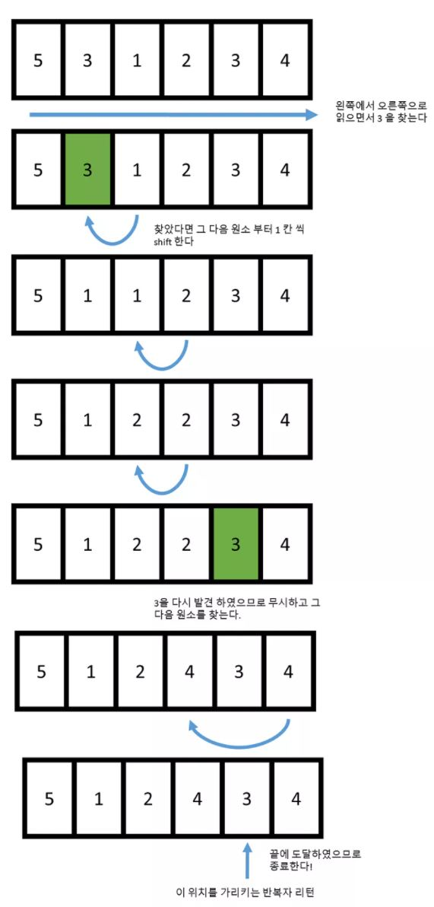

# 정렬(sort)


## 1. sort

일반적인 정렬 함수, 반복자는 반드시 임의접근 반복자(RandomAccessIterator) 타입을 만족해야한다.

```c++
template <typename Iter, typename Pred>
std::sort(Iter begin, Iter end, Pred pred)
```

`pred` 는 '특정한 조건'을 받는다. **함수 객체(Functor)** 로 전달하면 된다.

평균적으로 *O*(*N*log*N*) 으로 실행된다.


## 2. partial_sort

`partial_sort` 는 일부만 정렬하는 함수이다.

```c++
std::partial_sort(start, middle, end)
```

**[start , end]** 전체 원소들 중에서 **[start, middle]** 까지 원소만 정렬한다.

원소의 개수가 `N` 개이고, 정렬하려는 부분의 크기가 `M` 이라면 시간복잡도는 *O(N*log*M)* 가 된다.


## 3. stable_sort

`sort` 는 정렬 과정에서 원소들 간의 상대적 위치를 랜덤하게 바꿔버리지만 `stable_sort` 는 순서를 처음에 넣었던 상태 그대로 유지한다.

C++ 표준에 따르면 `sort` 는 최악의 경우에서도 `O(n log n)` 이 보장되지만 `stable_sort` 의 경우 최악의 경우에서 `O(n (log n)^2)` 으로 작동한다.


# 원소 제거(remove)


## 1. remove

```c++
std::remove(Iter begin, Iter end, T value)
```

해당 컨테이너 특정값 원소를 찾으면 앞칸씩 shit(값을 덮어씌운다) 한다. 만약 다시 특정값이 나오면 무시하고 그 다음 원소를 찾는다.




해당 마지막 위치에 `iterator` 를 리턴한다. 따라서 `remove` 함수는 원소의 이동만을 수행하고 실제로 원소를 삭제하지 않으므로, 아래와 같이  `erase` 함수를 호출하여 원소를 지워줘야한다.

```c++
v.erase(remove(v.begin(), v.end(), 3), v.end());
```

`remove` 함수의 반복자 타입은 `ForwardIterator` 이다. 따라서, 벡터, 리스트, 셋, 맵 모두 사용가능하다.


## 2. remove_if

```c++
std::remove_if(Iter begin, Iter end, Pred pred)
```

함수 객체를 활용해서 `remove` 함수를 사용한다. 주의점은 함수 객체 내 변수를 사용하면 **초기화**가 되는 경우도 있으므로, **외부변수**를 사용하는게 안전하다.


```c++
#include <iostream>
#include <vector>
#include <algorithm>

int main() {
    std::vector<int> v = {3,5,4,1,23,9,10};
    int remove_count = 0;
    // 2개 홀수만 제거
    v.erase(std::remove_if(v.begin(), v.end(),
                           [&remove_count](const int i)->bool{
                               if(remove_count >= 2) return false; // 2개 이상?
                               if(i&1) { // 홀수 ? 
                                   remove_count++;
                                   return true;
                               }
                               return false;
    }), v.end());
    for(auto i : v) std::cout << i << " ";
    // [output] : 4 1 23 9 10
    return 0;
}
```


## 3. 람다 함수(lambda function)

람다 함수는 아래와 같이 정의된다.

```c++
[capture list](parameter) -> return(type) {}
```

람다 함수는 자기 자신만의 스코프를 가져서 외부변수를 사용하려면 capture list에 capture를 해야 한다. `&` 를 사용하면 해당 변수의 레퍼런스를 받게 되고 만약 `&` 이 없으면 `const` 형태로 받기 때문에 값 변경이 불가능하다. 

또한, 클래스의 멤버 함수 안에서 람다를 사용할 때 멤버 변수들을 참조하려면 `this` 키워드를 사용해야 한다.

```c++
remove_count = 0;

v.erase(std::remove_if(v.begin(), v.end(),
                           [this](const int i)->bool{
                               if(this->remove_count >= 2) return false; // 2개 이상?
                               if(i&1) { // 홀수 ? 
                                   this->remove_count++;
                                   return true;
                               }
                               return false;
```


캡처 리스트 간단한 예는 아래와 같다.

- `[]` : 아무것도 캡쳐 안함
- `[&a, b]` : `a` 는 레퍼런스로 캡쳐하고 `b` 는 (변경 불가능한) 복사본으로 캡쳐
- `[&]` : 외부의 모든 변수들을 레퍼런스로 캡쳐
- `[=]` : 외부의 모든 변수들을 복사본으로 캡쳐


# 원소 수정(transform)

`transform` 함수 정의는 아래와 같다

```c++
std::transform(iter begin, iter end, iter start, Pred pred)
```

```c++
#include <iostream>
#include <vector>
#include <algorithm>

int main() {
    std::vector<int> v = {3,5,4,1,23,9,10};
    std::vector<int> v2(v.size(), 0);
    std::transform(v.begin(), v.end(), v2.begin(), [](const int i) -> int{ return i+1;});
    for(auto i : v2) std::cout << i << " ";
    return 0;
}

```

컨테이너에 `begin` 부터 `end` 까지 결과값을 `start` 부터 순차적으로 담아준다.


# 원소 탐색(find)


## 1. find

`find` 정의는 아래와 같다.

```c++
template <class InputIt, class T>
InputIt find(InputIt first, InputIt last, const T& value)
```

`first` 부터 `last` 까지 순회하면 `value` 값을 찾으면 해당 `iterator` 를 리턴한다.

연속적인 값을 찾고 싶다면 아래와 같이 해주면 된다.

```c++
#include <iostream>
#include <vector>
#include <algorithm>

int main() {
    std::vector<int> v = {3,5,3,1,3,9,10};

    auto iter = v.begin();
    while(true){
        iter = std::find(iter, v.end(), 3);
        if(iter == v.end()) break;
        std::cout << "at : " << std::distance(v.begin(), iter++) << std::endl;
        iter++;
    }

    return 0;
}
```

주의해야 할 점은, 만약에 컨테이너에서 기본적으로 [find](https://modoocode.com/261)함수를 지원한다면 이를 사용하는 것이 훨씬 빠르다. 왜냐하면 알고리즘 라이브러리에서의 [find](https://modoocode.com/261) 함수는 그 컨테이너가 어떠한 구조를 가지고 있는지에 대한 정보가 하나도 없기 때문이다

예를 들어 `set` 의 경우, `set` 에서 사용하는 [find](https://modoocode.com/261) 함수의 경우 *O*(log*n*) 으로 수행될 수 있는데 그 이유는 셋 내부에서 원소들이 정렬되어 있기 때문이다. 또 `unordered_set` 의 경우 [find](https://modoocode.com/261) 함수가 *O*(1) 로 수행될 수 있는데 그 이유는 `unordered_set` 내부에서 자체적으로 해시 테이블을 이용해서 원소들을 빠르게 탐색해 나갈 수 있기 때문이다.

하지만 그냥 알고리즘 라이브러리의 [find](https://modoocode.com/261) 함수의 경우 이러한 추가 정보가 있는 것을 하나도 모른채 우직하게 처음 부터 하나 씩 확인해 나가므로 평범한 *O*(*n*) 으로 처리된다. 따라서 알고리즘 라이브러리의 [find](https://modoocode.com/261) 함수를 사용할 경우 벡터와 같이 기본적으로 [find](https://modoocode.com/261) 함수를 지원하지 않는 컨테이너에 사용해야 한다.


## 2. find_if

`find` 에 함수객체를 인자로 받아서 `return` 값이 참인걸 찾는다.

```cpp
include <iostream>
#include <vector>
#include <algorithm>

int main() {
    std::vector<int> v = {3,5,3,1,3,9,10};
    auto iter_find = v.begin();
    while(true){
        iter_find = std::find_if(iter_find, v.end(),
                     [](const int i)->bool{
                         if(i%3 == 0) return true;
                         return false;
                     });
        if(iter_find == v.end()) break;
        std::cout << *iter_find << " % 3 = 0" << std::endl;
        iter_find++;

    }

    return 0;
}
```


## 3. any_of, all_of

`any_of` 는 인자로 받은 범위안의 모든 원소들 중 조건이 하나라도 만족하면 `true` 를 리턴하고, `all_of`는 모든 원소들이 만족해야 `true` 를 리턴한다.

즉, `any_of` 는 `OR` 연산과 비슷하고 `all_of`는 `AND` 연산과 비슷하다.


```c++
#include <iostream>
#include <vector>
#include <algorithm>

int main() {
    std::vector<int> v = {11,20,22,400,500,9,10};

    // 모든 원소가 10 이상? 
    std::cout << std::all_of(v.begin(), v.end(),
                             [](const int i)->bool{
                                 if(i >= 10) return true;
                                 return false;
    }) << std::endl; // => false
    // 원소 중에 10 이하가 있는가?
    std::cout << std::any_of(v.begin(), v.end(),
                             [](const int i)->bool{
                                 if(i <= 10) return true;
                                 return false;
    }) << std::endl; // => true

    return 0;
}
```


> 참조
>
> https://modoocode.com

