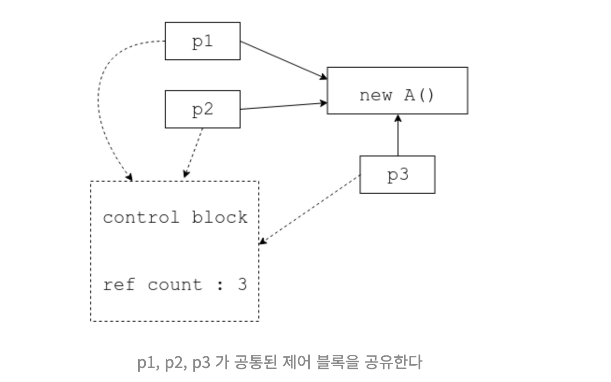

## shared_ptr

`unique_ptr` 일 경우에는 유일한 소유권만 인정 된다. 하지만 `shared_ptr` 는 여러 개의 `shared_ptr`이 같은 객체를 가리킬 수 있다.

```c++
#include <iostream>
#include <memory>
#include <vector>

class A {
    int data;

public:
    A(int data_) : data(data_) {
        std::cout << "constructor" << std::endl;
    }

    ~A() {
        std::cout << "destructor" << std::endl;
    }
};

int main() {
    std::vector<std::shared_ptr<A>> vec;
    vec.push_back(std::shared_ptr<A>(new A(10)));
    vec.push_back(vec[0]);
    vec.push_back(vec[1]);

    std::cout << "참조 개수 : " << vec[0].use_count() << std::endl;

    // 벡터의 첫번째 원소를 소멸 시킨다.
    std::cout << "첫 번째 소멸!" << std::endl;
    vec.erase(vec.begin());

    std::cout << "참조 개수 : " << vec[0].use_count() << std::endl;

    // 그 다음 원소를 소멸 시킨다.
    std::cout << "다음 원소 소멸!" << std::endl;
    vec.erase(vec.begin());

    std::cout << "참조 개수 : " << vec[0].use_count() << std::endl;

    // 마지막 원소 소멸
    std::cout << "마지막 원소 소멸!" << std::endl;
    vec.erase(vec.begin());


}
```

```shell
constructor
참조 개수 : 3
첫 번째 소멸!
참조 개수 : 2
다음 원소 소멸!
참조 개수 : 1
마지막 원소 소멸!
destructor
```

`vector` 안에 `A` 객체가 3개의 `shared_ptr`이 가리키고 있다. `use_count()`을 호출해서 참조되는 개수를 알 수 있고, 원소가 하나씩 소멸할 때 마다 참조되는 개수가 줄어드는걸 볼수 있다. 모든 원소가 소멸되면 비로서 `A` 를 객체를 가리키는 `shared_ptr`이 없으므로 `소멸자` 를 호출한다.


`shared_ptr` 는 처음으로 객체를 가리키는 `shared_ptr` 이 제어블록(control block)을 동적으로 할당한 후, `shared_ptr` 들이 해당 제어블록을 공유하는 방식으로 구현된다. 따라서 후에 할당되는 `shared_ptr` 들은 제어블록에 위치만 공유하면 된다.




```c++
std::shared_ptr<A> p1(new A(10))
```

만약 위와 같이 생성하면 `A()` 생성자를 한번 동적할당하고, `shared_ptr` 에서 제어 블록을 한번 더 동적 할당 하므로, 2번에 동적 할당 연산이 발생한다. 동적 할당 연산은 상당히 비싼 할당 이므로

```c++
std::shared_ptr<A> p1 = std::make_shared<A>();
```

`make_shared` 함수를 이용해서 객체 `A` 와 `shared_ptr` 의 제어블록 까지 한 번에 동적 할당 한 하는게 더 바람직 한다. (두 개 합친 크기로 한 번 할당 하게 된다.)


## shared_ptr 생성 주의점

`shared_ptr` 인자로 주소값을 전달하면, 주소값을 인자로 받은 `shared_ptr` 는 처음 객체를 전달 받은걸로 간주하고 각각에 제어블록을 소유하게 된다. 

```c++
#include <iostream>
#include <memory>
#include <vector>

class A {
    int data;

public:
    A(int data_) : data(data_) {
        std::cout << "constructor" << std::endl;
    }

    ~A() {
        std::cout << "destructor" << std::endl;
    }
};

int main() {
    A *a = new A(10);
    std::shared_ptr<A> p1(a);
    std::shared_ptr<A> p2(a);

    std::cout << "참조 개수 : " << p1.use_count() << std::endl;
    std::cout << "참조 개수 : " << p2.use_count() << std::endl;
}
```

```shell
constructor
참조 개수 : 1
참조 개수 : 1
destructor
destructor
Psi(3486,0x105f07600) malloc: *** error for object 0x600001b8c030: pointer being freed was not allocated
Psi(3486,0x105f07600) malloc: *** set a breakpoint in malloc_error_break to debug
```

2 개의 `shared_ptr` 는 인자로 `a`의 주소값을 전달 받는다. 처음 객체를 전달 받아서 각각의 제어블록을 할당해서 참조 개수는 1이다.

 `p1`에 포인터 객체가 반납 하면서 참조 개수가 0 이되서 객체 `A` 를 소멸하고, `p2` 또한 참조개수가 0 이 되면서 이미 소멸된 객체 `A` 를 또 소멸시켜서 오류가 발생한다.

이런 상황을 방지하기위해서, 주소값으로 `shared_ptr` 를 생성 하는것을 지양해야 한다.


## enable_shared_from_this

```c++
#include <iostream>
#include <memory>
#include <vector>

class A : public std::enable_shared_from_this<A> {
    int data;

public:
    A(int data_) : data(data_) {
        std::cout << "constructor" << std::endl;
    }

    ~A() {
        std::cout << "destructor" << std::endl;
    }

    std::shared_ptr<A> get_shared_ptr() {return shared_from_this();}
};

int main() {
    std::shared_ptr<A> p1 = std::make_shared<A>(30);
    std::shared_ptr<A> p2 = p1->get_shared_ptr();


    std::cout << "참조 개수 (" << p1.get() << ") : " << p1.use_count() << std::endl;
    std::cout << "참조 개수 (" << p2.get()  << ") : " << p2.use_count() << std::endl;
}
```

```shell
constructor
참조 개수 (0x600001a94288) : 2
참조 개수 (0x600001a94288) : 2
destructor
```

`enable_shared_from_this` 을 상속 받고 `shared_from_this()` 함수를 사용하면, 이미 정의 되어 있는 제어블록을 사용해서 `shared_ptr` 을 생성한다. 따라서 같은 객체에 두개 의 다른 제어 브록이 생성 되는 걸 막을수 있다.


만약 해당 객체에 `shared_ptr` 이 정의 되어 있지 않으면 제어블록이 없으므로, 오류가 발생한다. 

```c++
int main() {
    //std::shared_ptr<A> p1 = std::make_shared<A>(30);
    A* a = new A(10);
    std::shared_ptr<A> p2 = a->get_shared_ptr();


    //std::cout << "참조 개수 (" << p1.get() << ") : " << p1.use_count() << std::endl;
    //std::cout << "참조 개수 (" << p2.get()  << ") : " << p2.use_count() << std::endl;
}
```

```shell
libc++abi: terminating with uncaught exception of type std::__1::bad_weak_ptr: bad_weak_ptr
constructor
```

