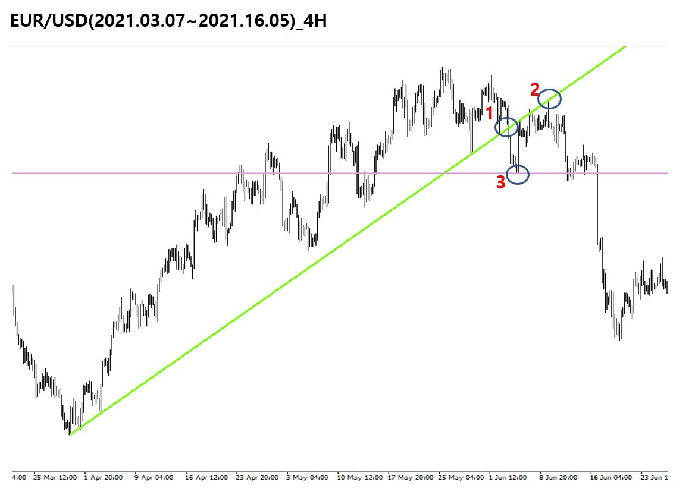

# 차트 패턴


## 추세선

### 외부추세선

여러 개의 고점이나 저점을 이은 직선

- 상향추세선 : 상승 추세의 주가 움직임에서 저점들을 연결한 직선, 추세선을 침범하면 추세가 상승세에서 하락세로 바뀌는 시그널을 나타남
- 하향추세선 : 하향 추세의 주가 움직임에서 고점들을 연결한 직선


### 내부추세선

고점이나 저점의 평평한 부분을 연결하는 직선, 종종 주가 움직임을 침범한다(직선이 주가 움직임을 스쳐 지나가는게 아니라 자르고 들어간다)


### 추세 곡선

포물선 형태나 가파른 모양의 추세선, 따라서 직선이 아닌 곡선 형태를 띤다.


### 추세선의 접점 간격

간격이 넓은 추세선에서 이탈이 일어났을 때 더 큰 폭의 주가 움직임이 뒤따른다는 사실을 과정


### 추세선의 접점 수

주가가 추세선과 만나는 횟수가 많을수록 이탈이 더 큰 의미를 갖는다고 과정


### 추세선의 길이

긴 추세선은 짧은 추세선보다 이탈 뒤에 더 큰 주가 움직임을 보인다고 과정


### 추세선의 기울기

기울기가 가파를수록 이탈 후 가격 하락폭이 크다고 과정


### 추세선과 이탈 거래량

- 거래량이 증가하고 있을 때 상향 추세선에서 하향 이탈이 일어날 경우 주가 하락폭이 클 것으로 예상
- 거래량이 감소하고 있을 때 하향 추세선에서 상향 이탈이 일어날 경우 주가 상승폭이 클 것으로 예상
- 상향 추세선에서 이탈 거래량이 평균 거래량을 초과하는 경우 하락폭이 더 크다
- 하향 추세선에서 이탈 거래량이 평균 거래랑 이하인 경우 상승폯이 더 크다


### 추세선으로 가격 목표점을 계산하는 법


- A : 추세선과 가격 마지막 접점 
- B : A 와 D 사이에서 최고점
- C : B에서 수직을 그려 추세선에 만나는 접점
- D : 추세선 이탈 시점
- 가격목표점(E) = D - (B - C)


### 추세선 그리기(code)

```c++
int OnInit()
{
   int u_start = 600;
   int end = 0;
   CreateTrendLine("TEST", u_start, end);
   return (INIT_SUCCEEDED);
}

void CreateTrendLine(const string str,
                     int start,
                     const int end)
{
   if(High[start] > High[end])
   {
      GetTre ndLine(str, start, end, High, 1); // downward trend line
   } 
   else
   {
      GetTrendLine(str, start, end, Low, -1); // upward trend line
   }
}

bool GetTrendLine(const string str,
                  int start,
                  const int end,
                  const double &array[],
                  const int x)
{
   double extremum = array[start];
   // Search extremum(Low or High)
   for(int i = start-1; i >= end; i--)
   {
      if(array[i]*x > extremum*x)
      {
         extremum = array[i];
         start = i;
      }
   }

   int index = start-1;
   double standard_slope = fabs(array[start] - array[start-1]) /1.0;
   // Search gentle slope 
   for(int i = start-2; i >= end; i--){
      double slope = fabs(array[start]-array[i])/(double)(start-i);
      if(slope < standard_slope)
      {
         index = i;
         standard_slope = slope;
      }
   }
   // create object(trend line)
   return ObjectCreate(0, str, OBJ_TREND, 0, Time[start], array[start], Time[index], array[index]);
}
```


### 1-2-3 추세 변환 확인 기법




1. 상향 추세선을 그린다(최저점에서 최고점 까지 저점을 잇은 직선)
2. 1은 이탈시점
3. 2는 이탈하고 난 후 주가 상승 최고점
4. 3은 1 과 2 사이의 최저점
5. 3을 뚫고 나가면 상승추세에서 하락추세로 넘어갔다고 본다.


## 지지와 저항

