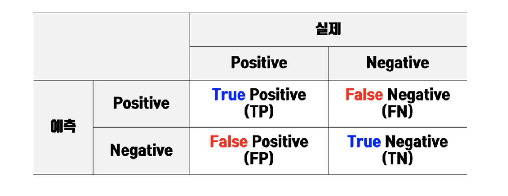

# 머신러닝의 필수 개념

## 1. 지도학습

- 정답을 알려주면서 진행되는 학습이며, 학습 시 데이터와 레이블(정답)이 항상 제공되어야 함
- 주어진 데이터와 레이블을 이용해 새로운 데이터의 레이블을 예측해야 할 때 사용

### 장점 

손쉽게 모델의 성능을 평가할 수 있음

### 단점

레이블이 없는 데이터의 레이블을 달기 위해 많은 시간을 투자해야 하는 단점 존재

## 2. 비지도학습

- 레이블(정답)이 없이 진행되는 학습, 학습 시 레이블 없이 데이터만 필요함
- 데이터 자체에서 패턴을 찾아내야 할 떄 사용

### 장점

별도로 레이블을 제공할 필요가 없으므로 시간 절약 가능

### 단점

레이블이 없으므로 모델의 성능을 평가하는데 다소 어려움이 있음

## 분류와 회귀

### 분류

데이터가 입력되었을 떄 지도 학습을 통해 미리 학습된 레이블중 **하나 또는 여러개의 레이블로** 예측하는 것

ex) 이진 분류, 다중 분류, 다중 레이블 분류

### 회귀

입력된 데이터에 대해 연속된 값으로 예측

ex) 날씨 예측, 주가 예측, 주택 가격 예측

## 3. 과소적합과 과대적합

### 과소적합(underfitting)

- 모델 학습 시, **충분하지 못한 특징만으로 학습** 되어, 특정 특징에만 편향되게 학습되는것(편향이 높음)
- 테스트 데이터 뿐만 아니라 학습 데이터에 대해서도 정확도가 낮게 나올 경우 과소 적합된 모델일 가능성이 높음
- 학습에 사용된 특징의 개수를 늘리는 방법을 통해 개선 

### 과대적합(overfitting)

- 학습 데이터에 대한 정확도는 매우 높지만 테스트 데이터 또는 학습 데이터 외의 데이터에는 정확도가 낮게 나오는 것(분산이 높음)
- 특지잉 필요 이상으로 많을 경우 발생
- 훈련 데이터를 더 많이 모으거나 학습에 사용된 특징의 개수를 줄이는 방법을 통해 개선

## 4. 혼동행렬

### TP(True Positive)

맞는 것을 올바르게 예측한 것

### TN(True Negative)

틀린 것을 올바르게 예측한 것

### FN(False Negative)

맞은 것을 틀렸다고 잘못 예측한 것

### FP(False Positive)

틀린 것을 맞다고 잘못 예측한 것

## 5. 머신러닝 모델의 성능평가

### 정확도(Accuracy)

- 입력된 데이터에 대해 올바르게 예측한 비율
- 혼동 행렬 상에서는 대각선을 전체 셀로 나눈 값에 해당

정확도 = (TP+TN)/(TP+TN+FN+FP)

### 정밀도(Precision)

- 모델의 에측 값이 얼마나 정확하게 예측됐는가를 나타내는 지표
- False를 True라고 판단하면 안되는 경우 중요

정밀도 = TP/(TP+FP)

### 재현율(Recall)

- 실제 값 중에서 모델이 검출한 실제 값의 비율을 나타내는 지표
- True를 False로 잘못 판단하면 큰일나는 경우 중요
- 정밀도와 재현율은 trade-off 관계

재현율 = TP/(TP+FN)

### F1 score

- 정밀도와 재현율 두 값을 조합하여 하나의 수치로 나타낸 지표
- 데이터의 레이블이 불균일하게 분포돼 있을 경우, 정확도는 왜곡된 성능 평가로 이어질 수 있으므로 사용

F1 socre = (2 * precision * recall)/(precision * recall)

### k-폴드 교차 검증(k-fold cross validation)

- 학습 데이터의 일정 부분을 검증데이터로 쓰되, n번의 검증 과정을 통해 학습 데이터의 모든 데이터를 한 번씩 검증데이터로 사용하는 방식
- Trading Set(훈련), Validation Set(검증), Test Set(실정)의 개념 구분

#### 장점

- 검증 결과가 일정 데이터에 치우치지 않고 모든 데이터에 대한 결과이므로 신빙성이 높음
- 별도로 검증 데이터를 분리하지 않아도 됨

