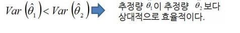
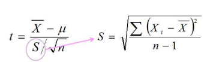

# 1) 이산확률분포

## 1. 확률분포란

한 변수가 어떤 실험이나 관찰의 결과로 나타날 수 있는 모든 상황과 각 상황이 나타날 확률을 표시한 것인데, 확률분포의 모양은 확률변수의 종류에 따라 상이하다.


## 2. 이산확률분포란

확률변수가 수량변수중에서 이산변수인 경우에 나타나는 분포를 의미한다.


## 3. 베르누이시행

어떤 실험에 대하여 2가지 결과만을 기대할 수 있는 것, 세가지 조건을 만족시키는 시행

- 한 사건의 두가지 결과 중 하나는 성공(S), 나머지 하나는 실패(F)로 구별
- 성공 확률 : p = P(S), 실패 확률 q = p(F) = 1-p, P(S)+P(F) = 1
- 각 시행은 서로 독립적이다. 즉, 한 시행의 결과는 '다음 시행의 결과에 아무런 영향을 미치지 못한다.'


## 4. 이항분포

### 정의

여러 번 베루누이 시행을 진행 할 떄, 성공의 횟수 혹은 실패의 횟수를 '이항확률변수(binomial random variable)'라고 한다. 'X'로 표시할 수 있다. 이항확률변수의 확률분포를 이항확률분포(binomial probability distribution) 혹은 간략히 이항분포(binomial distribution)라고 한다.

__ex) 동전을 3번 던져 앞면(H) 이 나올 확률__

1. 경우의 수는 $$2^3 = 8$$ 이다
2. 모든 경우의수를 표로 나타내면 아래와 같다.


### 확률함수


```python
import operator as op
from functools import reduce

def nCr(n, r):
    if n < 1 or r < 0 or n < r:
        raise ValueError
    r = min(r, n-r)
    numerator = reduce(op.mul, range(n, n-r, -1),1)
    denominator = reduce(op.mul, range(1, r+1), 1)
    return numerator//denominator

# n : 시행횟수, x : 성공횟수, p : 성공확률, 1-p : 실패확률
def BPD(n, x, p):
    bpd = nCr(n,x)*(p**x)*pow(1-p, n-x)
    return bp
```


### 특성(기대값, 분산, 표준편차)


```python
import math

# 기대값
def EV(n, p):
    return n*p

# 분산
def Var(n, p):
    return n*p*(1-p)

# 표준편차
def SD(n, p):
    return math.sqrt(Var(n,p))

```


## 5. 포아송분포

### 정의

정해진 시간, 거리 혹은 장소에서 발생하는 사건(성공)의 횟수를 나타낸 것을 포아송 확률변수(poisson distribution)라고 하며, 포아송확률번수의 확률분포를 포아송분포(poisson distribution)라고 한다. 포아송확률변수는  아래의 조건을 만족해야한다.

- 독립성 : 어떤 구간에서 일어날 성공의 수는 다른 구간에서 일어날 성공의 수와 서로 독립적이다.
- 비례성 : 동일한 길이의 구간에서 일어날 성공의 확률은 같으며, 성공의 수는 구간의 길이에 비례한다.
- 비군집성 : 구간이 아주 작아지면 두 번 이상의 성공이 일어날 확률은 0에 근접한다.


### 확률함수


```python
import math

def PD(u, x):
    numerator = u**x
    denominator = reduce(lambda x, y: x*y, range(1, x+1, 1))
    e = pow(math.exp(1), -u)
    return (numerator/denominator)*e
```


### 특성(기대값,분산, 표준편차)


```python
import math

# 기대값
def EV(n, p):
    return n*p

# 분산
def Var(n, p):
    return n*p

# 표준편차
def SD(n, p):
    return math.sqrt(Var(n,p))
```


# 2) 연속확률분포


## 1. 정의

일정한 범위에 있는 모든 **실수 값**을 취할 수 있는 확률번수를 연속확률변수(continuous random variable) 라고 하며, 이러한 확률변수가 이루는 분포를 연속확률분포(continuous probability distribution) 라고 한다.


## 2. 특징 

연속확률분포에는 다음과 같은 특징들이 있다.

- 연속확률분포에서 특정한 값 'x'가 발생활 확률 거의 '1/∞'이기 때문에 '0'이다, 즉 "P(X=x)=0"
- 연속확률분포에서의 확률은 일정구간(interval) 사이의 값을 취할 확률로 계산된다. 즉, p(a <= X <= b)는 [a,b] 사이의 확률밀도함수 f(x)와 X축 사이의 면적이다,
- 확률밀도함수는 언제나 (+)값을 갖는다. 즉 f(x)>=0 이다.
- 확률밀도함수 아래에 있는 전체의 면적은 언제나 '1'이다. 즉 p(-∞ <= X <= ∞)=1 이다.


## 3. 균일(균등분포)

균일분포(continuous uniform distribution)는 균등분포라고도 하며, 확률변수 X가 취할 수 있는 값이 일정한 범위 내에서 같은 확률로 발생하는 분포를 말한다.

### 확률밀도함수


## 4. 정규분포

정규분포는 정규곡선(normal curve)으로부터 유래한 분포로 가우스가 물리계측의 오차를 계산하는 과정에서 도입된 확률분포로 자연과학 뿐만 아니라 인문사회과학에서도 유용하기 이용되고 있는데, 수리적으로 라플라스(Pierre Laplace)에 의해 정립된 정규함수로부터 유래한 분포이다.

### 확률밀도함수 


### 정규분포의 특성

정규분포는 다음과 같은 특성을 가지고 있다.

- 정규분포의 위치와 모양은 분포의 평균과 표준편차로 결정된다.
- 정규분표의 확률밀도함수는 평균(i)을 중심으로 대칭인 종 모양이다.
- 확률변수 X의 범위는 -∞ < X < +∞
- 정규곡선과 x축 사이의 전체면적은 무조건 '1' 이다.
- 분포의 평균은 정규분포의 위치를 나타내며, 표준편차는 분포의 모양을 나타낸다.


# 3) 표준정규분포(Z분포)


## 1. 정의

서로 다른 모든 정규분포의 평균과 표준편차를 표준화 하여 표준적인 정규분포를 만든 것이 표준정규분포(standard normal distribution) 이다.

확률 변수는 `Z`, 평균은 `0`, 분산이 `1` 이 되도록 표준화한 것을 의미하며, "Z~N(0,1)" 로 표현하고, 표준화 Z은 다음과 같이 구한다.


정규분포를 표준정규분포로 전환하기 위한 방법은 아래와 같다.


## 2. 확률계산 

표준정규분포의 Z값에 따른 넓이만 알면 되며, 이 넓이를 표로 만든 것이 'Z-table' 이다

### code

```python
import scipy.stats as stats

# normal distribution to standardized Z
# x = 관측치, u = 평균, a = 표준편차
def GetZ(x, u, a):
    return (x-u)/a;

# 확률계산
def ProbZ(a , b):
    return stats.norm().cdf(b)-stats.norm().cdf(a)
```


# 4) 표본추출

모집단의 전체를 조사하지 않고도 모집단의 일부인 표본을 분석하여 모집단 전체의 특성을 추론하는 것이 추리통계학(inference statistics)이며, 이러한 통계적 연구의 시작이 표본의 추출(sampling)이다.


## 1. 필요성

- 경제성 : 모집단 전체를 조사, 분석하는 것에 비해 그 모집단의 일부를 추출하여 관찰하는 것이 시간적으로나 경비면에서 절감을 이룰 수 있다.
- 시간제약 : 단시간에 필요한 정보를 얻어야 하는 경우 유용하게 이용할 수 있다.
- 무한모집단 : 모집단의 규모를 결정할 수 없을 정도로 모집단이 무한히 큰 경우에 사용


## 2. 표본추출의 오류

측정상의 오차, 표본추출의 오류, 해석상의 잘못 등으로 인하여 실제 모집단의 값으로부터 멀어져서 오류가 발생한다.

- **표본추출오차(sampling error)** : 모집단을 대표할 수 있는 전형적인 구성요소를 표본으로 선택하지 못했기 떄문에 발생하는 오류
  - 우연하게 발생하는 오류 
    - 해결책 : 표본 수 증가, 계획단계부터 적정 분석대상을 파악
  - 모집단을 대표하기에 역부족인 비전형적인 구성요소를 표본으로 선택함에 따른 오류
    - 해결책 : 계획과 기획수정, 편의(bias)를 제거
- **비표본추출오차(non-sapling error)** : 표본의 선택과는 상관없이 발생하는 오류
  - 표본의 성격을 측정하는 방법이 부정확한 경우 발생하는 측정오차 오류
    - 해결책 : 근본적인 원인수정이 필요


## 3. 표본추출방법

표본추출의 오차는 편의(bias)와 우연성(chance)에 의하여 발생, 우연에 의한 오차는 표번 크기를 증가해서 감소 시킨다.

편의에 의한 오차는 다음과 같은 표본추출방법 이용한다.

- 확률표본추출(probability sampling) : 동일한 기회를 제공 하는 **무작의 추출(random sapling)**
- 비확률표본추출 : 확률추줄이 불가능하거나 비경제적일 경우에 사용하는 방법으로 연구자의 주관에 의해 표본이 선택되므로 오차를 포함하고, 편의추출과 판단추출로 구분 된다.
  - 편의추출(convenience sampling) : 모딥단에서 연구자가 손쉽게 구할 수 있는 구성원을 선택하여 표본으로 삼는 표본추출방법
  - 판단추출(judgement sampling) : 모집단의 성격에 대하여 어느 정도 전문지식이 있는 사람이 판단하는 방법


# 5) 표본분포

모집단에서 일정한 크기로 뽑을 수 있는 표본을 모두 추출하였을 때, 그 모든 표본의 특성치의 확률분포


# 6) 표본평균의 표본분포

특정한 모집단에서 동일한 크기로 가능한 모든 표본을 뽑아서 각각의 표본들의 평균을 산출할 때, 그 평균들의 확률분포를 말한다. 즉 표분평균은 확률변수인데, 이 확률변수인 표본평균들의 확률분포를 '표본평균의 표본분포' 라고 한다.


## 1. 평균(기대값)


## 2. 분산


## 3. 표준편차

모집단에서 평균을 선택하여 표본평균을 계산하면 두 평균 사이에 차이가 발생하게 되는데 이를 오차(error)라고 한다.

따라서, **표본평균 표준편차 == 평균의 표준오차**


## 4. code

```python
from itertools import product 
import pandas as pd
import numpy as np
from functools import reduce

# 모집단 평균
def Average(map_averages):
     return reduce(lambda x,y : x+y, [key*value for key, value in map_averages.items()])

# 모집단 분산
def Var(map_averages):
    u = Average(map_averages)
    return reduce(lambda x,y : x+y, [pow(key-u,2)*value for key, value in map_averages.items()])

# 가능 표본 조합 / 표본 평균 / 표본 추출 확률
def Table(m, r):
    key_list = list(m.keys())
    df = pd.DataFrame(columns=['sample', 'sample average', 'sampling probability'])
    for i in product(key_list, repeat=r):
        df = df.append({'sample' : i,  'sample average' : sum(i)/len(i),'sampling probability' : reduce(lambda x,y : x*y, [m[k] for k in i])},ignore_index=True)
    return df

# 표본분포
def SD(m, r):
    # drop colume
    cols = Table(m,r)[['sample average', 'sampling probability']]
    cols.sort_values(by=['sample average'], axis=0, inplace=True)
    array = cols.values
    df = pd.DataFrame(columns=['X','P(X)'])
    sum_prob = cols['sampling probability'][0]
    # 중복된 평균 합치기
    for i in range(1, len(array)): 
        if array[i][0] != array[i-1][0]:
            df = df.append({"X":array[i-1][0], "P(X)":sum_prob}, ignore_index=True)
            sum_prob = array[i][1]
        else :
            sum_prob += array[i][1]
    df = df.append({"X":array[-1][0], "P(X)":sum_prob}, ignore_index=True)
    return df

# 표본분포 평균
def SDU(m, r):
    sd = SD(m,r).values
    return reduce(lambda x,y : x+y, [i[0]*i[1] for i in sd])

# 표본분포 분산
def SDV(m, r):
    sd = SD(m, r).values
    u = SDU(m, r)
    return reduce(lambda x,y : x+y, [pow(i[0]-u, 2)*i[1] for i in sd])


```


## 5. 중심극한정리

모집단의 분포모양과는 관계없이 평균, 분산 인 모집단에서 크기가 n인 가능한 모든 표본을 뽑을 때, 표본의 크기가 커질수록 표본평균의 표본분포는 정규분포에 접근하게 되는 현상 

- 모집단이 정규분포이면 표본평균의 표본분포는 정규분포
- 모집단이 정규분포가 아니더라도 n 값이 커지면, 표본평균의 표본분포는 정규분포에 접근
- 표본의 크기(n)이 30이상이면 표본평균의 표본분포는 정규분포라고 본다


## 6. 표본평균의 표본분포 특성

1. 표본평균의 표본분포의 평균은 모집단의 평균과 같다.


2. 표본평균의 표본분포의 표준편차 즉 표준오차는 아래와 같다.


3. 모집단의 분포가 정규분포가 아닐 떄에도, 표본의 크기가 커지면, 표본평균의 표본분포는 정규분포에 접근한다.
4. 모딥단의 크기가 작아서 모집단의 크기 'N'에 대한 표본의 크기 'n'의 비율이 작지 않으면 표본평균의 표준편차는 다음과 같이 조정함


# 7. 표본비율의 표분본포

동일한 모집단에서 가능한 모든 표본을 뽑아 구한 비율들의 분포를 표본비율의 표본분포(sampling distirbution of proportion)라고 한다.

- 성공비율 r


- 이항분포를 이루는 모집단에서 크기가 n인 표본을 추출할 때. 그 표본에서의 성공 비율 p는 다음과 같다.


- 이항분포하는 S의 평균과 분산은 다음과 같다.


- 표본의 성공비율 에서의 평균과 분산은 다음과 같이 표현한다.


```python
# 모집단,표본의 성공비율
def SR(S, N):
    return S/N

# 이항분포 S의 평균
def SAver(S, N):
    return N*SR(S,N)

# 이항분포의 S의 분산
def SVar(S, N):
    r = SR(S,N)
    return N*r*(1-r)

# 표본의 성공비율 p 에 평균
def pAver(S, N):
    return SR(S,N)

# 표본의 성공비율 p 에 분산
def pVar(S, N, n):
    r = SR(S,N)
    return (r*(1-r))/n

# s - 성공횟수, N - 모집단 크기, n - 표본 크기
s = 0
N = 0
n = 0
```


# 8) 추정

모집단의 특성이 알려지지 않았거나 알려져 있는 특성에 신빙성이 없다고 생각될 때, 표본의 특성을 파악하여 모집단의 특성을 추론하기 위하여 표본조사를 해서 추정한다.


# 9) 점추정

하나의 값으로 모수값을 추정하는 방법, 모집단의 평균(u)을 알기 위하여 표분의 평균(X)을 이용하게 되는데 이떄, X는 u의 '추정량(estimator)'이 되며, 표본평균의 구체적인 수치 'X=600'은 평균을 추정하는 '추정치(estimate)'가 된다.

모집단의 모수를 추정하기 위한 추정량이 갖주어할 조건은 아래와 같다.

- **충족성(sufficiency)** : 추정량이 모수에 대하여 가장 많은 정보를 제공하는것
- **불편성(unbiasedness)** : 추정량의 기대값이 추정할 모수의 실제 값과 같은 추정량을 뜻한다.


- **효율성(efficiency)** : 최소의 분산을 가진 추정량이 가장 효율적이라고 할 수 있다.





- **일치성(consistency)** : 표본의 크기 n이 무한히 증가함에 따라 추정량이 모수에 일치하게 되는 추정량을 말한다.


# 10) 구간추정

추정값에 일정한 값을 가감하여 구간추정을 하게 되는 데, 이를 신뢰구간(confidence interval)이라고 한다.

- 신뢰구간은 '100(1-α)% 신뢰구간' 으로 표현한다.
- 신뢰구간이 모수를 포함할 확률을 신뢰수준(confidence level, 혹은 신뢰도) 라고 한다.
- α(알파)는 추정한 신뢰구간이 모수를 포함하지 않을 확률로 유의수준(significance level) 이라고 한다. 보통 '0.1, 0.05, 0.01' 이다


## 1. 모집단의 평균의 신뢰구간 추정 : α(모집단의 표준편차)를 알고 있는 경우

 α가 알려져있고, 모집단 분포가 정규분포 일 경우, 신뢰계수는 Z분포를 이용한다. 만약, 정규분포가 아닐경우에는 중심극한정리에 의해 표본 크기가 최소 30개 이상일 경우에만 Z분포를 이용한다

- 정규분포 또는 n 이 큰 경우에는 모집단 평균의 구간추정 공식은 다음과 같다.


- Z값에 대한 신뢰구간은 다음과 같다.


- α = 0.05일 떄, Z값에 신뢰구간은 다음과 같다.


- 신뢰구간은 신뢰도에 따라서 필요한 Z값을 정하여 추정하는 데, Z-분포표를 이용하여 이에 대응하는 Z값을 찾으면 된다. 예를 들어 90% 신뢰계수 Z는  Z = 0에서 0.45와 가장 가까운 값 Z = 1.64, 1.645, 1.65 중 하나를 사용하면 된다


```python
import math

# 신뢰도
confidence_level = {0.90 : 1.64, 0.95 : 1.96, 0.99 : 2.57}

def Presume(n, a, X, l):
    level = confidence_level[l]
    a = a/math.sqrt(n)
    left = X-(a*level)
    right = X+(a*level)
    print(left)    
    print(right)

# n - 표본 크기, a - 모집단 표준편차, X - 표본 평균, l - 신뢰구간
n = 100
a = 100000
X = 82000
l = 0.9
Presume(n, a, X, l)
```


## 2. 모집단의 평균의 신뢰구간 추정 : α를 모르고 있는 경우

표본의 표준편차를 모집단위 표준편차 대신 사용한다. 또한, 신뢰구간을 구하기 위해서는 다음과 같은 **t-분포** 를 이용한다.



t- 곡선의 모양을 결정하는 것은 자유도(degress of freedom : df = n-1)이다. t-분포를 이용한 신회구간추정은 다음과 같은 신뢰구간을 이용한다.


```python
import math
import scipy.stats as stats


def Presume(n, S, X, l):
    #find T critical value
    l = (1-l)/2
    t = stats.t.ppf(q=1-l,df=n-1)
    S = S/math.sqrt(n)
    left = X-(S*t)
    right = X+(S*t)
    print(left)    
    print(right)

# n - 표본 크기, S - 표본 표준편차, X - 표본 평균, l - 신뢰구간
n = 16
S = 8
X = 45
l = 0.95
Presume(n, S, X, l)
```


# 11) 가설검정

가설검정(hypothesis test)이란 표본으로부터 얻어진 사실에 근거하여 **모집단(모수)에 대한 주장이 타당한지를 여부를 검정하는 것**


## 1. 가설의 종류 및 용어

- **귀무가설(null hypothesis)** : 직접 검정대상이 되는 가설로 H0로 표기
- **대립가설(alternative hypothesis)** : 귀무가설이 기각될 때 받아들여지는 가설로 H1 혹은 HA로 표기
- **임계치(critical value)** : 주어진 유의수준에서 귀무가설의 채택과 기각에 관련된 의사결정을 할 때, 그 기준이 되는 점
- **유의수준(significance level)** : 오류의 가능성을 의미 ex) 유의수준 5% 는 α =0.05


## 2. 가설검정의 유형

- **양측검정(two-tail test)** : 가설검정에서 기각영역이 안쪽에 있는 형태


- **단측검정(one-tail test)** : 가설검정에서 기각영역이 한쪽에만 있는 형태


## 3. 가설검정의 오류

표본오차(sampling error)는 언제나 발생할 가능성이 잠재해 있기 떄문에, 표본에 근거를 둔 가설검정에서도 항상 오류를 동반하게 되며, α오류와 β

오류를 구분해 볼 수 있다.

- **α 오류** : 실제로는 귀무가설이 옳은데도, 검정 결과 귀무가설을 기각하는 오류(제 1종 오류, type I error)
- **β 오류** : 실제로는 귀무가설이 틀렸는데도, 검정 결과 귀무가설이 옳은 것으로 받아들이는 오류(제 2종 오류, type II error)


α 오류와 β 오류를 동시에 줄일 수 있는 방법은 두 표본분포가 겹치는 부분을 적게하는 것이므로 표본분포 표준편차(=표분오차)를 줄이는 것이다. 즉, 표본의크기(n)를 늘린다.


가설검정을 해서 이전의 모수치와 같다는 결론을 얻게 되면 연구의 결과가 새로운 것이 못되므로 의사결정에 아무런 도움을 주지 못하게 된다.

따라서 **1-β(통계적 검정력, statistical power)가 커지느도록 하는것이 바람직하다.**


## 4. 가설검정의 분석과정

1. 귀무가설과(H0)과 대립가설(H1)의 설정
2. 유의수준(α)의 결정 (0.05, 0.1, 0.01)
3. 유의수준을 총족시키는 임계치의 결정(채택영역과 기각영역) : 임계치는 Z값으로 변환하는 것이 편리
4. 통계량의 계산과 임계치와의 비교 : 표본을 기초로 계산된 이 Z값을 계산된 Z값(computed Z-value) 혹은 관측값, 'Zco'라고 표기


5. 결과해석 : 임계측값과 관측값(Zco)를 비교해 기각영역 안에 있으면 귀무가설(H0)을 기각, 채택영역 안에 있으면 H0을 채택


# 12) 모집단평균 가설검정


## 1. α를 알고 있는 경우

Z분포 이용하여 가설검정, 양측검정을 이용하여 유의수준 α를 양분하여, -Z(α/2) 와 Z(α/2)를 구한다

```python
import math

# 신뢰도
confidence_level = {0.90 : 1.64, 0.95 : 1.96, 0.99 : 2.57}

def HT(n, a, X, l, u):
    # 임계치 계산
    level = confidence_level[l]
    # (표본평균의 표준편차 = 평균의 표준오차) 계산
    a = a/math.sqrt(n) 
    # 통계량 계산
    Zco = (X-u)/a 
    print("Zco : ",Zco)
    # 채택 ? 기각 ?
    return -1*level < Zco and level > Zco

# n - 표본 크기, a - 모집단 표준편차, u - 모집단 평균,  X - 표본 평균, l - 신뢰구간
n = 25
u = 16
a = 1.5
X = 15.5
l = 0.95
HT(n, a, X, l, u)
```


## 2. α를 모르고 있는 경우

1. t-분포로 가설검정 하지만, 표본의 크기가 30개 이상일 경우에는 Z분포도 이용가능
2. S(표본분포의 표준편차)를 대신 사용, 통계량 t는 자유도 n-1의 t-분포에 이루게 된다.
3. 임계값은 t로 구한다. -t(α/2 , n-1) ~ +t(α/2, n-1)
4. 관측된 tco값이 임계치를 통하여 채택 되거나 기각 되는지 확인 t값(tco)을 구하는 공식은 아래와 같다.


```python
import math
import scipy.stats as stats
from functools import reduce


def Aver(array):
    return reduce(lambda x,y : x+y, array)/len(array)

def Std(array):
    aver = Aver(array)
    return math.sqrt(reduce(lambda x,y : x+y, [(i-aver)**2 for i in array])/(len(array)-1))

def Presume(n, S, X, l, u):
    #find T critical value
    l = (1-l)/2
    t = stats.t.ppf(q=1-l,df=n-1)
    # 표본분포의 표준편차(표준오차) 계산
    S = S/math.sqrt(n)
    # 통계값 계산
    tco = (X-u)/S
    print("tco : ", tco)
    return -1*t < tco and tco < t

# n - 표본 크기, S - 표본 표준편차, X - 표본 평균, l - 신뢰구간, u - 모집단 평균
array = [16, 28, 20, 34, 22, 18, 30, 22, 25, 15]
n = 10
S = Std(array)
X = Aver(array)
l = 0.95
u = 20
Presume(n, S, X, l, u)
```


# 13) 분산분석

여러 개의 모집단 평균을 동시에 비교하는 데 이용되는 통계적 연구방법을'분산분석(analysis of variance)' 혹은 'ANOVA'라고 한다. 분산분석은 독립변수 몇 개의 수준이나 범주로 나누고 각 수준에 따라 나누어진 집단가의 평균차를 검정하는 것이다.


## 1. 용어

- **요인(factor) or 독립변수(independent variable)** : 다수의 작은 집단으로 분류하는 기준이 되는 변수
- **종속변수(depentent variable)** : 각 집단의 비교대상이 되는 변수
- **일원분산분석(one-way ANOVA)** : 독립변수가 하나인 경우
- **이원분산분석(two-way ANOVA)** : 독립변수가 둘인 경우
- **요인수준(factor level)** : 다수의 집단은 용인의 수준에 따라 구분되므로 구분된 집단


## 2. 모형의 가정

분산분석은 다수의 모집단의 평균이 모두 같은가를 검정하는 기법이므로 귀무가설과 대립가설은 다음과 같이 설정된다.


- 귀무가설(H0) : 다수의 모집단들의 평균이 모두 동일
- 대립가설(H1) : 평균이 서로 다른 것이 하나 이상 존재
- 귀무가설이 기각된다면 요인수준에 따라 종속변수 값의 평균이 차이를 보이지 않는다. 따라서 독립변수가 종속변수에 영향을 미치지 않는다.
- 기본가정은 다음과 같다. 각 요인수준에 종속 변수값은 정규분포를 이루며, 분산은 모두 같으며, 표본은 서로 독립적이다.


# 14) 일원분산분석

독립변수가 하나이며, c개의 요인수준에 따라 종속변수의 평균에 차이가 있는지를 검정하는 기법


## 1) 분산분석 표기법


## 2) 가설 설정과 해석

1. 가설검정 : 위에 표에 세가지 강의 방법에 의한 평가에서 각 표본평균의 차이가 같은 모집단평균을 가진 모집단으로부터 발생하는 표본오차에 의한 것인지 아니면 강의방법에 의한 차이인지를 찾아내야 한다. 세가지 강의방법(A, B, C)의 집단 평균을 귀무가설과 대립가설로 표현하면 아래와 같다.


2. 가설검정의 해석 : 만약 귀무가설이 '참' 이라면, 강의방법에 의해 나타나는 평균 점수에 대한 그룹간의 분산은 같다. 즉, 세개의 각 집단(그룹)내의 관측 값의 차이(그룹내 차이)와 표본평균간의 차이(그룹간 차이)는 모두 표본추출과정에서 발생하는 우연한 오차(표본오차)가 된다.


## 3) 제곱합 혹은 변동(SS or variation)과 평균제곱(MS)

제곱합(sum of squares; SS)은 변동(variation)이라고 하며, 관측 값과 평균의 차이를 제곱하여 더해준다는 의미이다.


평균제곱(mean square: MS)은 변동을 **자유도**로 나누어 준 값을 말한다.


## 4) 그룹간 제곱합(sum of square due to betwwen group : SSB)

각 집단평균과 총평균 간의 차이를 즉정하는것


## 5) 그룹내 제곱합(sum of square due to error or within variation : SSE or SSW)

개별 관측 값이 각 그룹평균으로부터 떨어진 차이를 측정하는 것


## 6) 총제곱합(sum of square total : SST)

개별 관측값이 전체평균으로부터 떨어진 차이를 측정하느 것


## 7) 자유도와 평균제곱

- 그룹간 변동(SSB)과 그룹내 변동(SSE)을 비교함으로써 큰 차이가 없으면 강의방법에 따른 차이가 없다고 말할 수 있으며(귀무가설 채택), 큰 차이가 난다면 강의방법에 따른 차이가 있다고 말할 수 있다(귀무가설 기각).

- 그룹간 변동(SSB)과 그룹내 변동(SSE)을 공평하게 비교하기 위해서 각 변동(제곱합)에 상승하는 자유도로 나눈 값인 평균제곱(MS) 으로 비교, 계산식은 아래와 같다.


## 8) 검정통계량(F통계량)

F값은 다음과 같다.


귀무가설이 참이라면 F값은 1에 가까워진다. F값이 1보다 아주 크다면 그룹간의 차이(분자)가 있으므로 각 그룹의 모집단 평균이 다르다고 고려될 수 있으며, 귀무가설을 기각된다.


F-분포표로 이용한 방법은 다음과 같다.


F값이 3.89보다 클 확률은 0.05인데 Fco 값은 4.31 이므로 귀무가설은 유의수준 5%에서 기각 된다.
