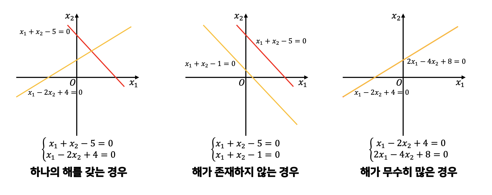
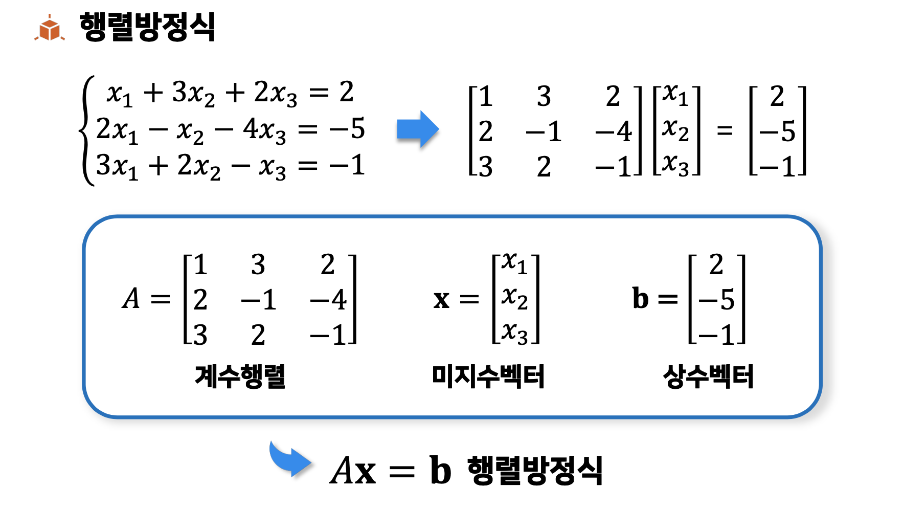

# 연립선형방정식

## 1.연립선형방정식의 해가 존재하는 형태

1. 하나의 해를 갖는 경우 : 교점
2. 해가 존재하지 않는 경우(불능) :  평행
3. 해가 무수히 많은 경우(부정) : 곁친다

## 2. 동치인 연립선형방정식

### 동치(equivalent)

: 두 연립선형방정식이 동일한 해집합을 가질 때

### 동치인 연립선형방정식을 만드는 연산

1. 두 선형방정식의 **위치 교환**
2. 선형방정식의 양변에 **상수배**(0이 아닌)
3. **상수배**한 선형방정식을 다른 선형방정식에 **더**하는것

## 3. 행렬방정식

## 4. 피벗

행렬에서 각 행의 맨 왼쪽에 있는 0이 아닌 성분

\begin{bmatrix}
2 & -1 &3 \\ 
 0&0  &2 \\ 
 0& 7 & 8
\end{bmatrix}

## 5.행 사다리꼴 행렬(REF,Row Echelon Form)
다음 조건을 만족하는 행렬
1. 성분이 모두 0인 행은 행렬의 맨 아래에 위치
2. 모든 피벗은 1
3. 아래 행은 피벗은 위쪽 행 피벗보다 오른쪽에 위치

ex)

$\begin{bmatrix}
1 & 4 &3 \\ 
 0& 1 &2 \\ 
 0& 0 & 1 
\end{bmatrix}$
$\begin{bmatrix}
1 & -1 &3 \\ 
 0&0  &1 \\ 
 0& 0 & 0
\end{bmatrix}$

## 6.기약행 사디꼴 행렬(RREF, Reduced Row Echelon Form)

어떤 행의 피벗을 포함하여 열의 다른 성분들은 모두 0인 REF

ex)

$\begin{bmatrix}
1 & 4 &3 \\ 
 0& 1 &2 \\ 
 0& 0 & 1 
\end{bmatrix}$
$\begin{bmatrix}
1 & -1 &3 \\ 
 0&0  &1 \\ 
 0& 0 & 0h
\end{bmatrix}$

## 7. 가우스 - 조단 소거법(Gauss-Jordan elimination method)

체계화된 절차로 연립선형방정식을 풀이

1. 피벗을 1로
2. RREF로

