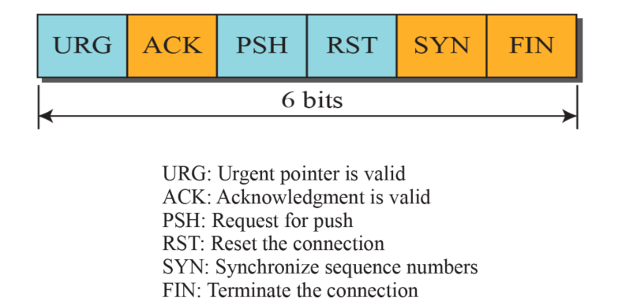

# TCP 기본동작

OSI에 전송계층에 프로토콜 중 하나인 TCP에 기본 연결 설정 및 해제를 실습을 통해 진행하고 Wireshark로 세그먼트를 추적해보는 목적으로 포스트를 작성하였다.

## TCP 란

전송계층에 속하는 TCP는 프로세스-대-프로세스 통신으로 포트 주소를 이용한다. 바이트 스트림 형태로 데이터를 송수신 하고, 일련의 바이트를 단위로 세그먼트로 전송 한다. 특징으로는 아래와 같다.

- 전이중 통신 서비스
  - 양방향으로 데이터를 송수신 한다.
- 신뢰성 서비스
  - 확인응답 매커니즘을 사용해 오류없는 데이터 전송 서비스를 제공한다.
- 연결 지향 서비스
  - 두 TCP간에 가상 연결을 설정한 후에 데이터를 교환한다.
  - 데이터 교환이 완료되면 연결을 종료한다.

## TCP 제어 Flag

- URG : 긴급데이터 바이트 플래그
- ACK : 세그먼트 도착 번호 플래그
- PSH : 응용계층으로 PUSH 여부 플래그
- RST : 초기화 플래그
- SYS : 연결 플래그
- FIN : 연결종류 플래그

## 3단계 핸드셰이크(3-way handshake)

### TCP 연결 설정

클라이언트가 서버로 TCP연결(SYN)을 요청하고(능동개방), 서버는 TCP에게 연결준비(수동개방) 되었다고 알리는 연결 설정 매커니즘이다.

절차는 아래와 같다.

1. 클라이언트 TCP가 임의의 초기 순서 번호(SYN) 세그먼트를 서버 TCP로 전송(전송하는 데이터는 없지만 하나의 순서 번호를 소비함)
2. 서버 TCP는 (SYN+ACK)세그먼트, rwnd(수신윈도우) 크기를 클라이언트 TCP로 전송
3. 클라이언트 TCP는 ACK 세그먼트, rwnd 크기를 서버 TCP로 전송

### TCP 연결 해제 

클라이언트 또는 서버가 연결을 종료 한다면,  절반 닫기 혹은 3단계 핸드셰이크를 이용한 연결 종료를 한다. 

3단계 핸드셰이크 방식의 절차는 아래와 같다.

1. 클라이언트 TCP가 서버 TCP에게 FIN 세그먼트를 전송
2. 서버 TCP가 클라이언트 TCP에게 (FIN+ACK) 세그먼트를 전송
3. 클라이언트 TCP가 서버 TCP에게 ACK세그먼트를 전송

절반-닫기(Half-Close)는, TCP통신이 완료된 방향만 연결을 해제하므로 4단계 핸드쉐이킹이 필요하다. 절차는 아래와 같다

1. 통신이 완료한 클라이언트 TCP가 서버 TCP에게 FIN 세그먼트 전송
2. 서버 TCP가 통신 완료된 클라이언트에게 ACK 세그먼트 전송
3. 서버 TCP가 통신 완료된 클라이언트 TCP에게 연결을 해제 한다고 FIN 세그먼트 전송
4. 통신 완료된 클라이언트 TCP는 서버 TCP 에게 ACK 세그먼트 전송

